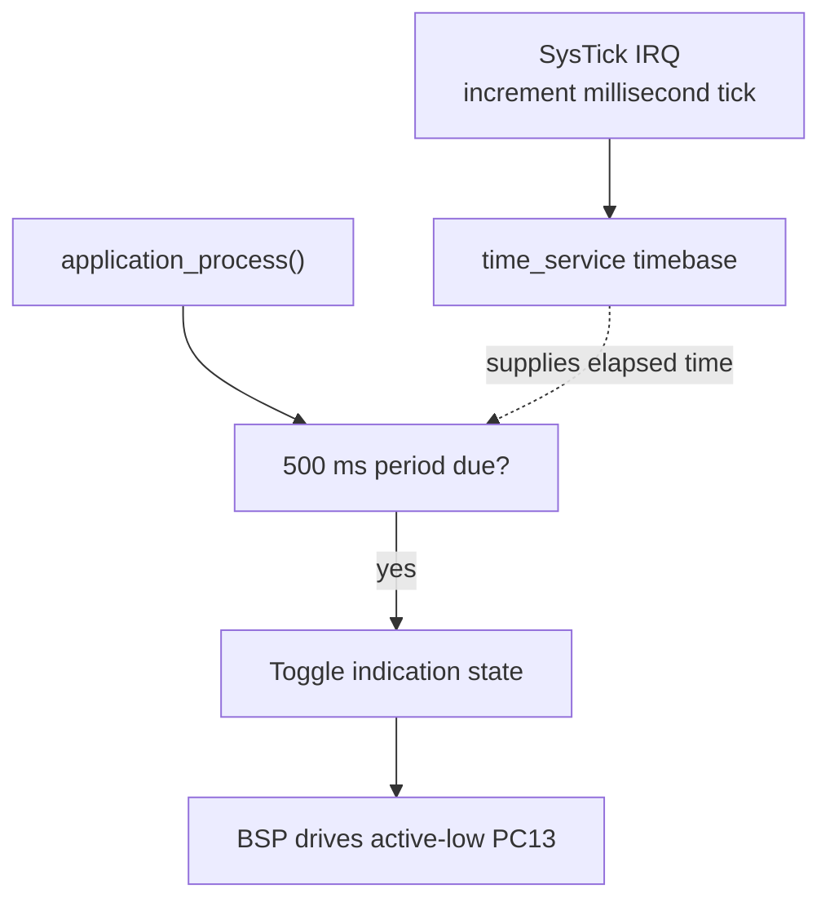

# Blink LED — GPIO Output + SysTick

> **Scope:** Example 1 of the repository progression — GPIO output, active-low board resource, SysTick timebase, non-blocking periodic scheduling.

[Main](https://github.com/haikevins/stm32f1-spl-procedural-baremetal) · [↑ Examples](../README.md) · [Next →](../02-gpio-input-interrupt/README.md) · [Architecture](docs/architecture.md) · [Porting](docs/porting_guide.md)

## Table of contents

- [Purpose and expected behavior](#purpose-and-expected-behavior)
- [Hardware and wiring](#hardware-and-wiring)
- [Configuration](#configuration)
- [Source ownership](#source-ownership)
- [Runtime flow](#runtime-flow)
- [Mechanism in depth](#mechanism-in-depth)
- [Concurrency and ownership](#concurrency-and-ownership)
- [Initialization and failure behavior](#initialization-and-failure-behavior)
- [Build, flash, and debug](#build-flash-and-debug)
- [Design decisions and limitations](#design-decisions-and-limitations)
- [Porting boundary](#porting-boundary)
- [References](#references)

## Purpose and expected behavior

At initialization the indication is made safe/inactive before the GPIO is configured as output. SysTick then increments a millisecond counter. `application_process()` asks `time_service_periodic_due()` whether 500 ms has elapsed and toggles the logical status indication when due.

This example remains intentionally small at Application level. The educational value is in the boundary between product policy and the lower-level mechanism: GPIO output, active-low board resource, SysTick timebase, non-blocking periodic scheduling.

## Hardware and wiring

Onboard Blue Pill LED on PC13, active-low. No external peripheral is required beyond SWD.

```text
Blue Pill PC13 ---- onboard LED network ---- 3.3 V

Logical ON  -> PC13 driven LOW
Logical OFF -> PC13 driven HIGH
```

SWD uses PA13/PA14 and common ground. The checked-in OpenOCD setup does not require the probe's NRST signal.

## Configuration

| Constant | Value | Meaning |
|---|---:|---|
| `APPLICATION_BLINK_PERIOD_MS` | 500 ms | logical toggle period |
| `BOARD_TIMEBASE_HZ` | 1000 Hz | SysTick service rate |
| `BOARD_HSE_FREQUENCY_HZ` | 8 MHz | board oscillator definition |

Compile-time constants live under `config/`; board mappings live under `bsp/bluepill/`. Application source therefore does not duplicate pin numbers, raw peripheral names, or clock-tree formulas.

## Source ownership

```text
app/src/application.c
  -> time_service + indication_service
services/src/time_service.c
  -> board_timebase
services/src/indication_service.c
  -> board_led
bsp/bluepill/src/board_timebase.c
  -> SysTick / CMSIS
bsp/bluepill/src/board_led.c
  -> GPIOC / SPL
```

The dependency direction is checked by `tools/scripts/check_layers.py`. `system/system_init.c` is the composition root and is allowed to connect the layers; Application is not.

## Runtime flow



The reset/startup sequence before this flow is common to every example: custom `Reset_Handler` initializes `.data` and `.bss`, calls vendor `SystemInit()`, then project `main()` calls `system_init()` and enters the cooperative loop.

## Mechanism in depth

### Active-low abstraction

The BSP knows that PC13 is electrically active-low; `indication_service` exposes logical on/off/toggle semantics. This prevents application policy from depending on `Bit_RESET` versus `Bit_SET`.

### SysTick arithmetic

The BSP calls `SysTick_Config(SystemCoreClock / BOARD_TIMEBASE_HZ)`. At the normal 72 MHz core clock and 1 kHz timebase, the counter is reloaded for a 1 ms period. `SysTick_Handler` performs only a bounded increment of a `volatile uint32_t` millisecond count.

`time_service_elapsed_ms()` relies on unsigned subtraction, so elapsed-time tests remain valid across the natural 32-bit wrap as long as intervals remain far below half the modulo range.

### Periodic scheduling policy

`time_service_periodic_due()` assigns the reference timestamp to `now` when the period expires. That is simple and appropriate here, but it means repeated loop latency can shift the phase gradually. Example 05 intentionally contrasts this with `reference += period`, which preserves nominal phase more closely.

## Concurrency and ownership

Only SysTick is asynchronous. The ISR owns the time counter; thread mode reads it and executes all LED policy. No GPIO action is required in interrupt context.

The general repository rule still holds: the lowest layer that owns an interrupt source acknowledges/publishes hardware state, while Services/Application consume that state outside the ISR unless a truly low-level bounded operation is required.

## Initialization and failure behavior

Initialization order:

```text
board GPIO/timebase → Time Service → Indication Service → Application
```

`system_init()` returns failure if the board/timebase setup cannot be established; `main()` enters `system_panic()`. This example has no runtime peripheral fault channel after successful initialization.

`main()` treats a failed `system_init()` as fatal and calls `system_panic()`, which disables interrupts and remains in a debug-friendly halt loop.

## Build, flash, and debug

```bash
make check-layers
make clean
make
```

The build creates `build/firmware.elf`, `.hex`, `.bin`, `.lst`, dependency files, and a linker map. Useful targets are:

```bash
make size
make tree
make flash
make erase
make debug-server
make debug
```

`make all` runs the architectural layer checker before compilation. The Makefile targets Cortex-M3/Thumb, compiles C11 with `-Og -g3`, places each function/data object in its own section, links with the project linker script, enables linker garbage collection, and deliberately uses `-nostartfiles -nostdlib`. Only compiler runtime support (`-lgcc`) is linked explicitly.

The repository uses ST-Link/SWD with OpenOCD and GDB. `tools/openocd/bluepill_stlink.cfg` selects the ST-Link interface, SWD transport, the STM32F1 target, a conservative 1 MHz adapter rate, and `reset_config none`. That reset policy is intentional for boards where NRST is not wired to the probe.

A typical two-terminal session is:

```bash
# Terminal 1
make debug-server

# Terminal 2
make debug
```

The checked-in GDB command file connects to `localhost:3333`, halts/resets the target, loads the ELF, sets a breakpoint at `main`, and continues. The ELF retains source-level debug information because the default optimization is `-Og` with `-g3`.

For this example, inspect its public Application/Service variables and peripheral registers in GDB rather than adding unrelated logging dependencies simply for observation.

## Design decisions and limitations

- `__NOP()` idle favors predictable debugging, not low power.
- A 1 ms tick consumes periodic interrupt bandwidth even though the application needs only 500 ms events.
- The Service abstraction is intentionally more structure than a one-line LED demo needs; the structure exists to establish conventions reused later.

These are documented constraints of the example, not claims that the mechanism is universally optimal.

## Porting boundary

The most important porting boundaries are LED pin/polarity, clock source, `SystemCoreClock`, and SysTick frequency. If only the board LED changes, Application and Services should remain unchanged.

See [the detailed porting guide](docs/porting_guide.md) for the change matrix and validation order.

## References

- [STMicroelectronics — STM32F103 documentation](https://www.st.com/en/microcontrollers-microprocessors/stm32f103/documentation.html)
- [STMicroelectronics — RM0008: STM32F101/102/103/105/107 reference manual](https://www.st.com/resource/en/reference_manual/cd00171190-stm32f101xx-stm32f102xx-stm32f103xx-advanced-arm-based-32-bit-mcus-stmicroelectronics.pdf)
- [STMicroelectronics — PM0056: STM32F10xxx Cortex-M3 programming manual](https://www.st.com/resource/en/programming_manual/pm0056-stm32f10xxx20xxx21xxxl1xxxx-cortexm3-programming-manual-stmicroelectronics.pdf)
- [Arm — CMSIS Core documentation](https://arm-software.github.io/CMSIS_5/Core/html/index.html)
- [GNU Binutils — linker scripts](https://sourceware.org/binutils/docs/ld/Scripts.html)
- [OpenOCD documentation](https://openocd.org/pages/documentation.html)
- [GDB — remote debugging](https://sourceware.org/gdb/current/onlinedocs/gdb.html/Remote-Debugging.html)


---

[Main](https://github.com/haikevins/stm32f1-spl-procedural-baremetal) · [↑ Examples](../README.md) · [Next →](../02-gpio-input-interrupt/README.md) · [Architecture](docs/architecture.md) · [Porting](docs/porting_guide.md)
