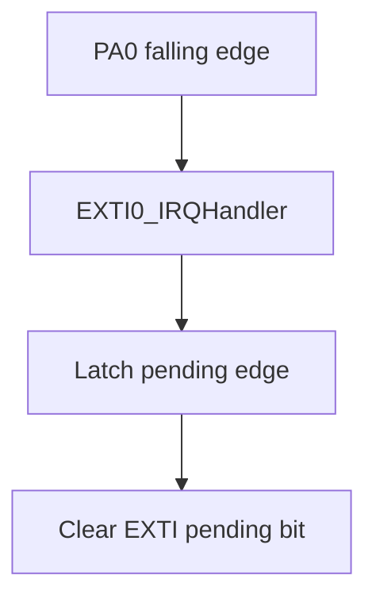
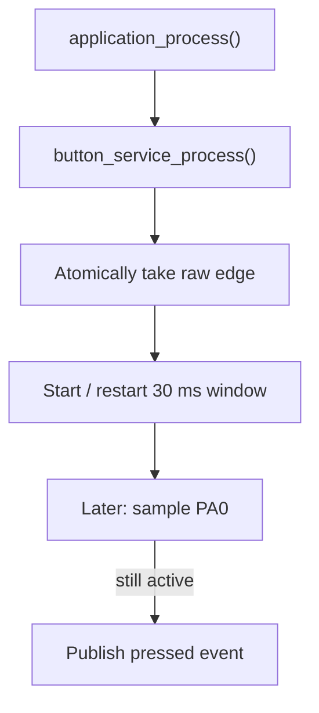

# GPIO Input Interrupt — EXTI + Debounce

> **Scope:** Example 2 of the repository progression — active-low button, AFIO/EXTI mapping, minimal ISR publication, deferred 30 ms debounce.

[Main](https://github.com/haikevins/stm32f1-spl-procedural-baremetal) · [↑ Examples](../README.md) · [← Previous](../01-blink-led/README.md) · [Next →](../03-uart-polling/README.md) · [Architecture](docs/architecture.md) · [Porting](docs/porting_guide.md)

## Table of contents

- [Purpose and expected behavior](#purpose-and-expected-behavior)
- [Hardware and wiring](#hardware-and-wiring)
- [Configuration](#configuration)
- [Source ownership](#source-ownership)
- [Runtime flow](#runtime-flow)
- [Mechanism in depth](#mechanism-in-depth)
- [Concurrency and ownership](#concurrency-and-ownership)
- [Initialization and failure behavior](#initialization-and-failure-behavior)
- [Build, flash, and debug](#build-flash-and-debug)
- [Design decisions and limitations](#design-decisions-and-limitations)
- [Porting boundary](#porting-boundary)
- [References](#references)

## Purpose and expected behavior

A falling edge on PA0 raises EXTI0. The ISR does not debounce and does not toggle the LED; it records one pending edge and clears the EXTI flag. Thread mode consumes that edge atomically, starts/restarts a 30 ms window, and later reads the pin. Only a still-low input becomes a debounced pressed event. Application consumes that logical event and toggles the status indication.

This example remains intentionally small at Application level. The educational value is in the boundary between product policy and the lower-level mechanism: active-low button, AFIO/EXTI mapping, minimal ISR publication, deferred 30 ms debounce.

## Hardware and wiring

User button on PA0 wired to GND. PA0 is configured as input pull-up, so release reads HIGH and press reads LOW. The onboard PC13 LED remains the logical indication output.

```text
3.3 V
  |
  +-- internal pull-up
  |
 PA0 -------- push button -------- GND

PC13 -------- onboard active-low LED
```

SWD uses PA13/PA14 and common ground. The checked-in OpenOCD setup does not require the probe's NRST signal.

## Configuration

| Constant | Value | Meaning |
|---|---:|---|
| `BOARD_TIMEBASE_HZ` | 1000 Hz | millisecond timebase |
| `BUTTON_DEBOUNCE_TIME_MS` | 30 ms | stable-low qualification time |
| EXTI line | EXTI0 | PA0 interrupt line |
| EXTI trigger | falling edge | HIGH→LOW candidate press |
| NVIC preemption priority | 2 | EXTI0 priority configured by BSP |

Compile-time constants live under `config/`; board mappings live under `bsp/bluepill/`. Application source therefore does not duplicate pin numbers, raw peripheral names, or clock-tree formulas.

## Source ownership

```text
app/src/application.c
  -> button_service + indication_service
services/src/button_service.c
  -> board_button + time_service
bsp/bluepill/src/board_button.c
  -> GPIOA + AFIO + EXTI0 + NVIC
bsp/bluepill/src/board_timebase.c
  -> SysTick
```

The dependency direction is checked by `tools/scripts/check_layers.py`. `system/system_init.c` is the composition root and is allowed to connect the layers; Application is not.

## Runtime flow



Thread-mode qualification:



The reset/startup sequence before this flow is common to every example: custom `Reset_Handler` initializes `.data` and `.bss`, calls vendor `SystemInit()`, then project `main()` calls `system_init()` and enters the cooperative loop.

## Mechanism in depth

### GPIO and EXTI mapping

PA0 is not automatically connected to EXTI0 merely because the line numbers match. BSP enables AFIO and selects GPIOA as the EXTI0 source, configures falling-edge EXTI, clears stale pending state, then enables the NVIC line.

### ISR-to-thread handoff

`board_button_take_press_edge()` masks interrupts using PRIMASK, copies/clears the `volatile bool` pending flag, then restores the caller's previous interrupt-enable state. The critical section protects the read-modify-clear operation against a concurrent EXTI edge. Restoring the original PRIMASK instead of blindly enabling interrupts makes the helper safe when called from an already-masked context.

### Event coalescing

The ISR publishes a boolean, not a counter. Multiple edges that occur before thread mode takes the flag collapse into one candidate event. For a mechanical button this is intentional: the goal is a qualified logical press, not edge metrology.

### Debounce state model

```text
IDLE
  |
  | candidate edge consumed
  v
QUALIFYING  -- another edge --> restart 30 ms window
  |
  +-- 30 ms + PA0 LOW  --> publish PRESSED event -> IDLE
  |
  +-- 30 ms + PA0 HIGH -------------------------> IDLE
```

### Deferred debounce

Each consumed candidate edge resets the debounce start timestamp. After 30 ms, the Service samples the real pin and publishes a separate logical pressed event only if it remains active. This keeps time-dependent policy outside EXTI context.

## Concurrency and ownership

SysTick updates time; EXTI0 publishes the raw candidate. PRIMASK protects take-and-clear. Debounce state and logical pressed-event state are owned by thread mode.

The general repository rule still holds: the lowest layer that owns an interrupt source acknowledges/publishes hardware state, while Services/Application consume that state outside the ISR unless a truly low-level bounded operation is required.

## Initialization and failure behavior

Initialization order:

```text
board LED/button/timebase → Time Service → Indication Service → Button Service → Application
```

There is no runtime retry mechanism because GPIO/EXTI have no transactional device fault here. A wrong pin source, polarity, pending-bit sequence, or timebase manifests as missing/repeated press events and should be diagnosed at the BSP boundary.

`main()` treats a failed `system_init()` as fatal and calls `system_panic()`, which disables interrupts and remains in a debug-friendly halt loop.

## Build, flash, and debug

```bash
make check-layers
make clean
make
```

The build creates `build/firmware.elf`, `.hex`, `.bin`, `.lst`, dependency files, and a linker map. Useful targets are:

```bash
make size
make tree
make flash
make erase
make debug-server
make debug
```

`make all` runs the architectural layer checker before compilation. The Makefile targets Cortex-M3/Thumb, compiles C11 with `-Og -g3`, places each function/data object in its own section, links with the project linker script, enables linker garbage collection, and deliberately uses `-nostartfiles -nostdlib`. Only compiler runtime support (`-lgcc`) is linked explicitly.

The repository uses ST-Link/SWD with OpenOCD and GDB. `tools/openocd/bluepill_stlink.cfg` selects the ST-Link interface, SWD transport, the STM32F1 target, a conservative 1 MHz adapter rate, and `reset_config none`. That reset policy is intentional for boards where NRST is not wired to the probe.

A typical two-terminal session is:

```bash
# Terminal 1
make debug-server

# Terminal 2
make debug
```

The checked-in GDB command file connects to `localhost:3333`, halts/resets the target, loads the ELF, sets a breakpoint at `main`, and continues. The ELF retains source-level debug information because the default optimization is `-Og` with `-g3`.

For this example, inspect its public Application/Service variables and peripheral registers in GDB rather than adding unrelated logging dependencies simply for observation.

## Design decisions and limitations

- Boolean edge publication deliberately coalesces bounce bursts.
- Polling the pin after 30 ms gives one-shot qualification, not a full press/release state machine.
- The input relies on the MCU internal pull-up; external EMC requirements may demand stronger biasing/filtering.

These are documented constraints of the example, not claims that the mechanism is universally optimal.

## Porting boundary

Porting requires reviewing GPIO electrical mode, active polarity, AFIO EXTI source, EXTI line/group IRQ name, NVIC priority, and the debounce interval. Application should still consume only a logical pressed event.

See [the detailed porting guide](docs/porting_guide.md) for the change matrix and validation order.

## References

- [STMicroelectronics — STM32F103 documentation](https://www.st.com/en/microcontrollers-microprocessors/stm32f103/documentation.html)
- [STMicroelectronics — RM0008: STM32F101/102/103/105/107 reference manual](https://www.st.com/resource/en/reference_manual/cd00171190-stm32f101xx-stm32f102xx-stm32f103xx-advanced-arm-based-32-bit-mcus-stmicroelectronics.pdf)
- [STMicroelectronics — PM0056: STM32F10xxx Cortex-M3 programming manual](https://www.st.com/resource/en/programming_manual/pm0056-stm32f10xxx20xxx21xxxl1xxxx-cortexm3-programming-manual-stmicroelectronics.pdf)
- [Arm — CMSIS Core documentation](https://arm-software.github.io/CMSIS_5/Core/html/index.html)
- [GNU Binutils — linker scripts](https://sourceware.org/binutils/docs/ld/Scripts.html)
- [OpenOCD documentation](https://openocd.org/pages/documentation.html)
- [GDB — remote debugging](https://sourceware.org/gdb/current/onlinedocs/gdb.html/Remote-Debugging.html)


---

[Main](https://github.com/haikevins/stm32f1-spl-procedural-baremetal) · [↑ Examples](../README.md) · [← Previous](../01-blink-led/README.md) · [Next →](../03-uart-polling/README.md) · [Architecture](docs/architecture.md) · [Porting](docs/porting_guide.md)
