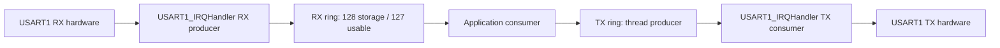

# UART Interrupt + Ring Buffer

> **Scope:** Example 4 of the repository progression — USART1 asynchronous RX/TX using two SPSC rings, error accounting, TXE interrupt gating, bounded application work.

[← Root](../../README.md) · [↑ Examples](../README.md) · [← Previous](../03-uart-polling/README.md) · [Next →](../05-timer-pwm/README.md) · [Architecture](docs/architecture.md) · [Porting](docs/porting_guide.md)

## Table of contents

- [Purpose and expected behavior](#purpose-and-expected-behavior)
- [Hardware and wiring](#hardware-and-wiring)
- [Configuration](#configuration)
- [Source ownership](#source-ownership)
- [Runtime flow](#runtime-flow)
- [Mechanism in depth](#mechanism-in-depth)
- [Concurrency and ownership](#concurrency-and-ownership)
- [Initialization and failure behavior](#initialization-and-failure-behavior)
- [Build, flash, and debug](#build-flash-and-debug)
- [Design decisions and limitations](#design-decisions-and-limitations)
- [Porting boundary](#porting-boundary)
- [References](#references)

## Purpose and expected behavior

RXNE interrupts push received bytes into an RX ring while thread mode consumes it. Thread mode pushes outgoing bytes into a TX ring while TXE interrupts consume it. The startup banner is queued without waiting for wire transmission, then incoming data is echoed. If the TX ring fills after an RX byte has been consumed, the application keeps exactly one pending echo byte until space becomes available.

This example remains intentionally small at Application level. The educational value is in the boundary between product policy and the lower-level mechanism: USART1 asynchronous RX/TX using two SPSC rings, error accounting, TXE interrupt gating, bounded application work.

## Hardware and wiring

USART1 remains on PA9 TX and PA10 RX at 115200 8N1. The hardware wiring is identical to Example 03; the difference is software concurrency and buffering.

```text
Blue Pill                 USB-UART (3.3 V)
-------------------------------------------
PA9  / USART1_TX  ------> RX
PA10 / USART1_RX  <------ TX
GND                 ----- GND
```

SWD uses PA13/PA14 and common ground. The checked-in OpenOCD setup does not require the probe's NRST signal.

## Configuration

| Setting | Value |
|---|---:|
| USART | USART1 |
| Baud | 115200 8N1 |
| NVIC priority | 5 |
| RX storage | 128 bytes |
| TX storage | 128 bytes |
| Usable ring capacity | 127 bytes each |
| Application process budget | 32 operations/call |

Compile-time constants live under `config/`; board mappings live under `bsp/bluepill/`. Application source therefore does not duplicate pin numbers, raw peripheral names, or clock-tree formulas.

## Source ownership

```text
app/src/application.c
  -> uart_service
services/src/uart_service.c
  -> board_uart buffered API
bsp/bluepill/src/board_uart.c
  -> USART1 ISR + two byte_ring_buffer instances
common/src/byte_ring_buffer.c
  -> generic SPSC storage mechanics
```

The dependency direction is checked by `tools/scripts/check_layers.py`. `system/system_init.c` is the composition root and is allowed to connect the layers; Application is not.

## Runtime flow



The reset/startup sequence before this flow is common to every example: custom `Reset_Handler` initializes `.data` and `.bss`, calls vendor `SystemInit()`, then project `main()` calls `system_init()` and enters the cooperative loop.

## Mechanism in depth

### SPSC ownership

The generic `byte_ring_buffer` is in `common/` because it knows nothing about UART. Each ring reserves one slot so equality of head/tail can represent empty unambiguously; therefore 128 bytes of storage provide 127 bytes of usable capacity.

Ownership is asymmetric and fixed:

```text
RX: ISR = sole producer, thread = sole consumer
TX: thread = sole producer, ISR = sole consumer
```

This is why the ring can avoid a general-purpose lock. Head/tail publication is accompanied by `COMPILER_MEMORY_BARRIER()` so compiler reordering does not violate the publish/consume sequence.

### RX path and error handling

The handler snapshots USART status, handles ORE/NE/FE/PE conditions, reads DR as required to clear receive/error state, increments diagnostics, and attempts to push the byte. If the RX ring is full, an overflow counter records the loss instead of blocking inside the ISR.

### TXE interrupt gating

Leaving TXEIE enabled while the TX ring is empty would cause repeated interrupts because TXE remains asserted. The ISR disables TXEIE when no byte remains. Every successful thread-mode enqueue enables TXEIE; if TXE is already set, the interrupt becomes pending and draining resumes. This is a small interrupt-driven state machine, not a permanently running interrupt source.

### Bounded application budget

`APPLICATION_PROCESS_BUDGET` limits one `application_process()` call to 32 successful units of work. Under continuous traffic, this prevents the echo task from monopolizing the cooperative loop. `application_has_pending_work()` exists as an extension hook, but the current `system_idle()` is `__NOP()` and does not use that hook to implement race-free WFI sleep.

## Concurrency and ownership

This is the first example with continuous bidirectional ISR/thread shared data. Correctness depends on single-producer/single-consumer ownership, volatile index observation, compiler barriers, and never allowing a second producer/consumer to mutate a ring.

The general repository rule still holds: the lowest layer that owns an interrupt source acknowledges/publishes hardware state, while Services/Application consume that state outside the ISR unless a truly low-level bounded operation is required.

## Initialization and failure behavior

Initialization order:

```text
board USART/ring state → UART Service → Application
```

The BSP counts RX overflow and UART hardware errors. These counters make overload/noise observable without doing formatted logging in the ISR. The application itself keeps echo semantics simple and does not attempt retransmission or a framed protocol.

`main()` treats a failed `system_init()` as fatal and calls `system_panic()`, which disables interrupts and remains in a debug-friendly halt loop.

## Build, flash, and debug

```bash
make check-layers
make clean
make
```

The build creates `build/firmware.elf`, `.hex`, `.bin`, `.lst`, dependency files, and a linker map. Useful targets are:

```bash
make size
make tree
make flash
make erase
make debug-server
make debug
```

`make all` runs the architectural layer checker before compilation. The Makefile targets Cortex-M3/Thumb, compiles C11 with `-Og -g3`, places each function/data object in its own section, links with the project linker script, enables linker garbage collection, and deliberately uses `-nostartfiles -nostdlib`. Only compiler runtime support (`-lgcc`) is linked explicitly.

The repository uses ST-Link/SWD with OpenOCD and GDB. `tools/openocd/bluepill_stlink.cfg` selects the ST-Link interface, SWD transport, the STM32F1 target, a conservative 1 MHz adapter rate, and `reset_config none`. That reset policy is intentional for boards where NRST is not wired to the probe.

A typical two-terminal session is:

```bash
# Terminal 1
make debug-server

# Terminal 2
make debug
```

The checked-in GDB command file connects to `localhost:3333`, halts/resets the target, loads the ELF, sets a breakpoint at `main`, and continues. The ELF retains source-level debug information because the default optimization is `-Og` with `-g3`.

For this example, inspect its public Application/Service variables and peripheral registers in GDB rather than adding unrelated logging dependencies simply for observation.

## Design decisions and limitations

- 127-byte usable capacity is the cost of a simple head==tail empty representation.
- SPSC rings are efficient but cease to be correct if multiple producers/consumers are added without a stronger synchronization design.
- A 32-operation budget favors cooperative fairness over maximum echo throughput.
- `application_has_pending_work()` is currently not connected to idle policy.

These are documented constraints of the example, not claims that the mechanism is universally optimal.

## Porting boundary

Porting must preserve the interrupt source semantics, handler name, priority, and SPSC ownership. Ring sizes can change, but memory cost and overflow behavior should be measured. A DMA-based UART would change the lower-layer handoff while higher Service semantics could remain non-blocking.

See [the detailed porting guide](docs/porting_guide.md) for the change matrix and validation order.

## References

- [STMicroelectronics — STM32F103 documentation](https://www.st.com/en/microcontrollers-microprocessors/stm32f103/documentation.html)
- [STMicroelectronics — RM0008: STM32F101/102/103/105/107 reference manual](https://www.st.com/resource/en/reference_manual/cd00171190-stm32f101xx-stm32f102xx-stm32f103xx-advanced-arm-based-32-bit-mcus-stmicroelectronics.pdf)
- [STMicroelectronics — PM0056: STM32F10xxx Cortex-M3 programming manual](https://www.st.com/resource/en/programming_manual/pm0056-stm32f10xxx20xxx21xxxl1xxxx-cortexm3-programming-manual-stmicroelectronics.pdf)
- [Arm — CMSIS Core documentation](https://arm-software.github.io/CMSIS_5/Core/html/index.html)
- [GNU Binutils — linker scripts](https://sourceware.org/binutils/docs/ld/Scripts.html)
- [OpenOCD documentation](https://openocd.org/pages/documentation.html)
- [GDB — remote debugging](https://sourceware.org/gdb/current/onlinedocs/gdb.html/Remote-Debugging.html)


---

[← Root](../../README.md) · [↑ Examples](../README.md) · [← Previous](../03-uart-polling/README.md) · [Next →](../05-timer-pwm/README.md) · [Architecture](docs/architecture.md) · [Porting](docs/porting_guide.md)
