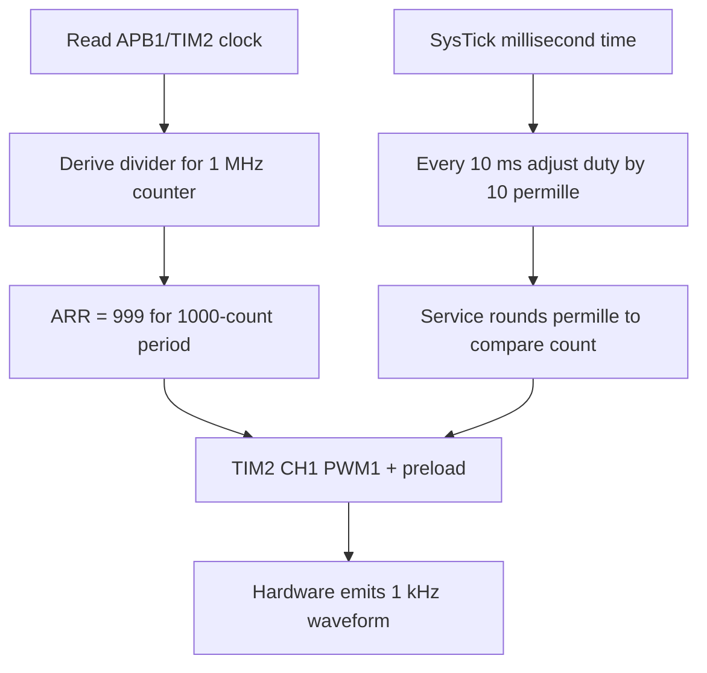
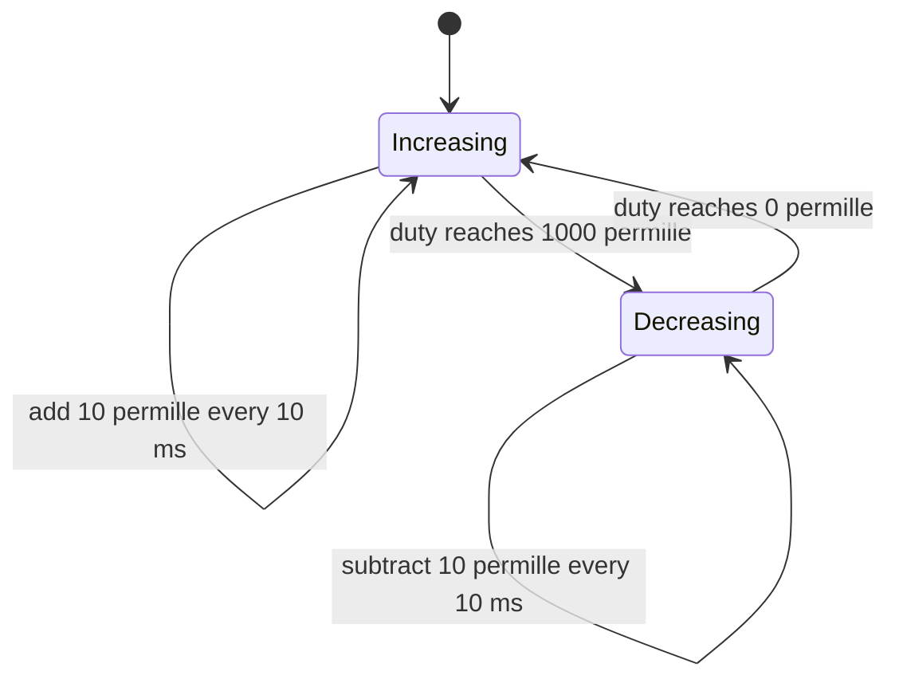

# Timer PWM — TIM2 Channel 1

> **Scope:** Example 5 of the repository progression — hardware PWM on PA0 with timer-clock derivation, PSC/ARR/CCR math, permille duty API, drift-aware software ramp.

[← Root](../../README.md) · [↑ Examples](../README.md) · [← Previous](../04-uart-interrupt-ring-buffer/README.md) · [Next →](../06-i2c-display/README.md) · [Architecture](docs/architecture.md) · [Porting](docs/porting_guide.md)

## Table of contents

- [Purpose and expected behavior](#purpose-and-expected-behavior)
- [Hardware and wiring](#hardware-and-wiring)
- [Configuration](#configuration)
- [Source ownership](#source-ownership)
- [Runtime flow](#runtime-flow)
- [Mechanism in depth](#mechanism-in-depth)
- [Concurrency and ownership](#concurrency-and-ownership)
- [Initialization and failure behavior](#initialization-and-failure-behavior)
- [Build, flash, and debug](#build-flash-and-debug)
- [Design decisions and limitations](#design-decisions-and-limitations)
- [Porting boundary](#porting-boundary)
- [References](#references)

## Purpose and expected behavior

The BSP configures TIM2 so its counter ticks at 1 MHz and wraps every 1000 counts, producing a 1 kHz PWM period. Application changes duty by 10 permille every 10 ms, ramps from 0 to 1000 and back, and delegates compare calculation to the PWM Service.

This example remains intentionally small at Application level. The educational value is in the boundary between product policy and the lower-level mechanism: hardware PWM on PA0 with timer-clock derivation, PSC/ARR/CCR math, permille duty API, drift-aware software ramp.

## Hardware and wiring

TIM2_CH1 is output on PA0. The documented demo wiring is PA0 through approximately 330 Ω and an LED to GND. SysTick supplies only the slow control timebase; TIM2 generates every PWM edge in hardware.

```text
PA0 / TIM2_CH1 ---- 330 ohm ---- LED ---- GND
```

SWD uses PA13/PA14 and common ground. The checked-in OpenOCD setup does not require the probe's NRST signal.

## Configuration

| Constant | Value |
|---|---:|
| `BOARD_TIMEBASE_HZ` | 1000 Hz |
| `BOARD_PWM_TIMER_TICK_HZ` | 1,000,000 Hz |
| `BOARD_PWM_FREQUENCY_HZ` | 1,000 Hz |
| `PWM_BREATH_UPDATE_PERIOD_MS` | 10 ms |
| `PWM_BREATH_STEP_PERMILLE` | 10 (1%) |
| Duty API range | 0..1000 permille |

Compile-time constants live under `config/`; board mappings live under `bsp/bluepill/`. Application source therefore does not duplicate pin numbers, raw peripheral names, or clock-tree formulas.

## Source ownership

```text
app/src/application.c
  -> time_service + pwm_service
services/src/pwm_service.c
  -> board_pwm duty/count API
bsp/bluepill/src/board_pwm.c
  -> RCC clock query + GPIOA + TIM2_CH1
bsp/bluepill/src/board_timebase.c
  -> SysTick
```

The dependency direction is checked by `tools/scripts/check_layers.py`. `system/system_init.c` is the composition root and is allowed to connect the layers; Application is not.

## Runtime flow



The reset/startup sequence before this flow is common to every example: custom `Reset_Handler` initializes `.data` and `.bss`, calls vendor `SystemInit()`, then project `main()` calls `system_init()` and enters the cooperative loop.

## Mechanism in depth

### APB1 timer clock

TIM2 is on APB1. Under the normal 72 MHz clock tree, PCLK1 is 36 MHz, but STM32F1 timers receive twice PCLK when the APB prescaler is not 1. The BSP explicitly checks that condition and obtains a 72 MHz TIM2 input.

To get a 1 MHz counter tick:

```text
PSC divider = 72 MHz / 1 MHz = 72
PSC register = 72 - 1 = 71
```

For 1 kHz PWM:

```text
period counts = 1,000,000 / 1,000 = 1000
ARR = 1000 - 1 = 999
```

The code validates divisibility and 16-bit timer-range constraints instead of silently truncating an impossible configuration.

### Duty conversion

The Service accepts 0..1000 permille. Compare is rounded as approximately:

```text
CCR = (duty_permille * period_counts + 500) / 1000
```

Allowing compare to equal `period_counts` represents a true 100% logical duty under the chosen PWM configuration. TIM2 output-compare and ARR preload are enabled so register updates take effect coherently.

### Duty-ramp state model



### Two timescales

The carrier is not software-toggled. Hardware maintains 1 kHz PWM even if the super-loop is late. Thread mode only modifies the slow duty envelope every 10 ms. The application advances `s_last_update_ms += period` rather than assigning `now`, preventing small scheduling delays from accumulating into long-term ramp drift.

## Concurrency and ownership

SysTick is the only software interrupt needed by the demo. PWM waveform timing is an autonomous timer-hardware responsibility. Thread mode owns duty policy and register update requests through the Service.

The general repository rule still holds: the lowest layer that owns an interrupt source acknowledges/publishes hardware state, while Services/Application consume that state outside the ISR unless a truly low-level bounded operation is required.

## Initialization and failure behavior

Initialization order:

```text
board TIM2 PWM + timebase → Time Service → PWM Service → Application
```

Initialization fails if the runtime timer clock cannot be divided exactly to the configured tick or if the requested period exceeds the supported counter range. There is no runtime waveform-monitor feedback.

`main()` treats a failed `system_init()` as fatal and calls `system_panic()`, which disables interrupts and remains in a debug-friendly halt loop.

## Build, flash, and debug

```bash
make check-layers
make clean
make
```

The build creates `build/firmware.elf`, `.hex`, `.bin`, `.lst`, dependency files, and a linker map. Useful targets are:

```bash
make size
make tree
make flash
make erase
make debug-server
make debug
```

`make all` runs the architectural layer checker before compilation. The Makefile targets Cortex-M3/Thumb, compiles C11 with `-Og -g3`, places each function/data object in its own section, links with the project linker script, enables linker garbage collection, and deliberately uses `-nostartfiles -nostdlib`. Only compiler runtime support (`-lgcc`) is linked explicitly.

The repository uses ST-Link/SWD with OpenOCD and GDB. `tools/openocd/bluepill_stlink.cfg` selects the ST-Link interface, SWD transport, the STM32F1 target, a conservative 1 MHz adapter rate, and `reset_config none`. That reset policy is intentional for boards where NRST is not wired to the probe.

A typical two-terminal session is:

```bash
# Terminal 1
make debug-server

# Terminal 2
make debug
```

The checked-in GDB command file connects to `localhost:3333`, halts/resets the target, loads the ELF, sets a breakpoint at `main`, and continues. The ELF retains source-level debug information because the default optimization is `-Og` with `-g3`.

For this example, inspect its public Application/Service variables and peripheral registers in GDB rather than adding unrelated logging dependencies simply for observation.

## Design decisions and limitations

- Exact-divisibility checks favor predictable math over accepting approximate timer rates.
- Permille is a simple integer API that avoids floating point and exposes 0.1% units even though actual timer resolution is 1/1000 here.
- The visual “breathing” is a linear duty ramp, not perceptual gamma correction.

These are documented constraints of the example, not claims that the mechanism is universally optimal.

## Porting boundary

When changing timer/channel, recompute actual timer input from the bus prescaler rules, verify AF pin mapping/remap, timer width, PWM mode/polarity, and preload behavior. Do not copy PSC/ARR values across clock trees.

See [the detailed porting guide](docs/porting_guide.md) for the change matrix and validation order.

## References

- [STMicroelectronics — STM32F103 documentation](https://www.st.com/en/microcontrollers-microprocessors/stm32f103/documentation.html)
- [STMicroelectronics — RM0008: STM32F101/102/103/105/107 reference manual](https://www.st.com/resource/en/reference_manual/cd00171190-stm32f101xx-stm32f102xx-stm32f103xx-advanced-arm-based-32-bit-mcus-stmicroelectronics.pdf)
- [STMicroelectronics — PM0056: STM32F10xxx Cortex-M3 programming manual](https://www.st.com/resource/en/programming_manual/pm0056-stm32f10xxx20xxx21xxxl1xxxx-cortexm3-programming-manual-stmicroelectronics.pdf)
- [Arm — CMSIS Core documentation](https://arm-software.github.io/CMSIS_5/Core/html/index.html)
- [GNU Binutils — linker scripts](https://sourceware.org/binutils/docs/ld/Scripts.html)
- [OpenOCD documentation](https://openocd.org/pages/documentation.html)
- [GDB — remote debugging](https://sourceware.org/gdb/current/onlinedocs/gdb.html/Remote-Debugging.html)


---

[← Root](../../README.md) · [↑ Examples](../README.md) · [← Previous](../04-uart-interrupt-ring-buffer/README.md) · [Next →](../06-i2c-display/README.md) · [Architecture](docs/architecture.md) · [Porting](docs/porting_guide.md)
