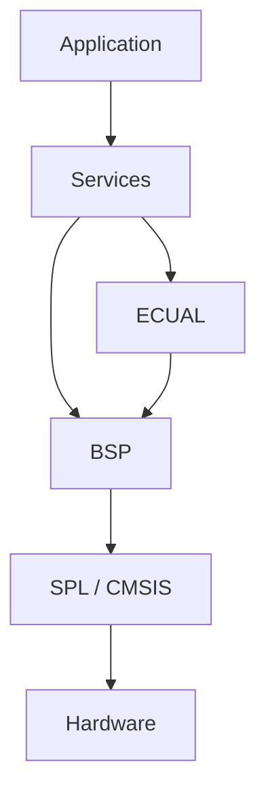
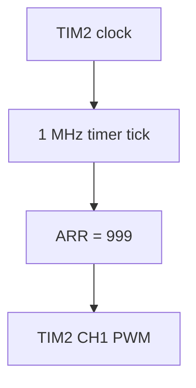
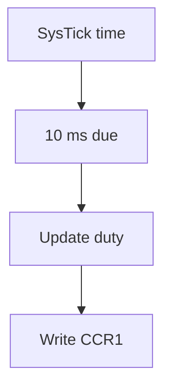

# Architecture — Timer PWM — TIM2 Channel 1

> **Scope:** Internal ownership, dependency direction, initialization, data flow, concurrency, timing, and failure propagation for `05-timer-pwm`.

[Main](https://github.com/haikevins/stm32f1-spl-procedural-baremetal) · [↑ Examples](../../README.md) · [← Example README](../README.md) · [Architecture](architecture.md) · [Porting](porting_guide.md)

## Table of contents

- [Architectural objective](#architectural-objective)
- [Layer and source map](#layer-and-source-map)
- [Composition and initialization](#composition-and-initialization)
- [Runtime data flow](#runtime-data-flow)
- [Concurrency contract](#concurrency-contract)
- [Timing and memory reasoning](#timing-and-memory-reasoning)
- [Failure and observability](#failure-and-observability)
- [Extension boundaries](#extension-boundaries)
- [References](#references)

## Architectural objective

This example is not organized around “one source file per peripheral demo.” It keeps the repository's core rule: **Application expresses policy; lower layers own mechanisms and physical resources**. The concrete subject is hardware PWM on PA0 with timer-clock derivation, PSC/ARR/CCR math, permille duty API, drift-aware software ramp.

The design should remain understandable in both directions:

- reading downward explains how a logical request reaches STM32 hardware;
- reading upward explains how low-level hardware state becomes a bounded, meaningful event/capability for Application.

## Layer and source map

```text
app/src/application.c
  -> time_service + pwm_service
services/src/pwm_service.c
  -> board_pwm duty/count API
bsp/bluepill/src/board_pwm.c
  -> RCC clock query + GPIOA + TIM2_CH1
bsp/bluepill/src/board_timebase.c
  -> SysTick
```



The layer checker is part of the architecture contract. A lower-layer implementation can change without authorizing Application to bypass its public Service interface.

## Composition and initialization

The reset path is common to the repository. After `.data/.bss` initialization and `SystemInit()`, `main()` delegates composition to `system_init()`.

For this example the important dependency order is:

```text
board TIM2 PWM + timebase → Time Service → PWM Service → Application
```

The order matters because a module should never receive events or invoke a dependency before its state is valid. Peripheral flags are cleared and NVIC lines are configured only after associated storage/state is ready.

## Runtime data flow

Hardware carrier:



Slow duty policy:



Data does not jump directly from an interrupt/peripheral into product policy. Every arrow has an owner and an API boundary. This lets the code document both **lifetime** and **authority** of the state being moved.

## Concurrency contract

SysTick is the only software interrupt needed by the demo. PWM waveform timing is an autonomous timer-hardware responsibility. Thread mode owns duty policy and register update requests through the Service.

### Key invariants

- Only BSP derives timer clock and programs TIM2 registers.
- Application owns duty trajectory, not waveform edges.
- Duty value remains within 0..1000 permille.
- The chosen tick/frequency must fit the 16-bit counter and be exactly derivable under current policy.

### Phase reasoning

The duty scheduler adds a fixed 10 ms to its reference each update. If one loop iteration is late, the next nominal deadline remains anchored to the original phase rather than moving to “late time + 10 ms.” This differs intentionally from Example 01's simpler blink helper.

The repository uses `volatile` for state that can change asynchronously, but `volatile` alone is not treated as a lock or a complete synchronization primitive. Where a compound take/clear or block copy must be atomic with respect to an ISR, the code uses a short PRIMASK critical section. Where SPSC ring publication depends on compiler ordering, it uses an explicit compiler barrier.

## Timing and memory reasoning

The project has no heap. Buffers, device state, counters, and Application state are statically or automatically allocated and are therefore visible in the link map.

Clock-dependent behavior is derived from CMSIS/SPL clock state wherever the example needs exact peripheral timing. The normal board configuration is 72 MHz HCLK, 72 MHz PCLK2, 36 MHz PCLK1, with APB1 timers receiving 72 MHz because their bus prescaler is not 1.

The most important timing-specific behavior for this example is described in its [README](../README.md); source constants under `config/` are authoritative.

## Failure and observability

Initialization fails if the runtime timer clock cannot be divided exactly to the configured tick or if the requested period exceeds the supported counter range. There is no runtime waveform-monitor feedback.

Initialization failure propagates toward `system_init()` instead of being silently ignored. Runtime diagnostics are deliberately low-overhead: counters, state flags, and GDB-visible globals are preferred to adding a logging subsystem that would change the example's peripheral/concurrency profile.

## Extension boundaries

When extending this example:

1. keep board pin/peripheral mapping in BSP/configuration;
2. keep external-device command semantics in ECUAL when an off-chip device is involved;
3. expose a Service capability rather than an SPL type to Application;
4. keep ISR work bounded and define the publication/ownership rule before writing the handler;
5. update `config/modules.mk` only with the SPL sources actually required;
6. run `make check-layers` before accepting the change;
7. document any new buffer capacity, timeout, drop policy, interrupt priority, or destructive operation.

## References

- [STMicroelectronics — STM32F103 documentation](https://www.st.com/en/microcontrollers-microprocessors/stm32f103/documentation.html)
- [STMicroelectronics — RM0008: STM32F101/102/103/105/107 reference manual](https://www.st.com/resource/en/reference_manual/cd00171190-stm32f101xx-stm32f102xx-stm32f103xx-advanced-arm-based-32-bit-mcus-stmicroelectronics.pdf)
- [STMicroelectronics — PM0056: STM32F10xxx Cortex-M3 programming manual](https://www.st.com/resource/en/programming_manual/pm0056-stm32f10xxx20xxx21xxxl1xxxx-cortexm3-programming-manual-stmicroelectronics.pdf)
- [Arm — CMSIS Core documentation](https://arm-software.github.io/CMSIS_5/Core/html/index.html)
- [GNU Binutils — linker scripts](https://sourceware.org/binutils/docs/ld/Scripts.html)
- [OpenOCD documentation](https://openocd.org/pages/documentation.html)
- [GDB — remote debugging](https://sourceware.org/gdb/current/onlinedocs/gdb.html/Remote-Debugging.html)


---

[Main](https://github.com/haikevins/stm32f1-spl-procedural-baremetal) · [↑ Examples](../../README.md) · [← Example README](../README.md) · [Architecture](architecture.md) · [Porting](porting_guide.md)
