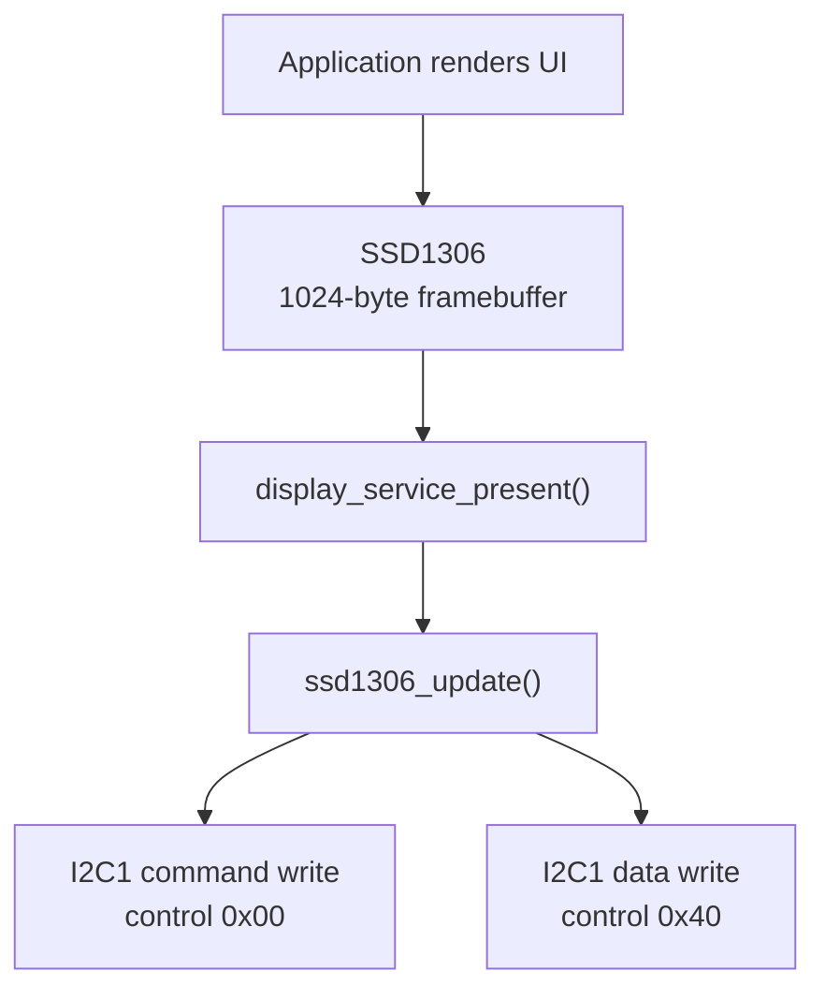

# I2C Display — SSD1306

> **Scope:** Example 6 of the repository progression — I2C1 bounded polling, SSD1306 ECUAL protocol, 128×64 static framebuffer, periodic presentation.

[Main](https://github.com/haikevins/stm32f1-spl-procedural-baremetal) · [↑ Examples](../README.md) · [← Previous](../05-timer-pwm/README.md) · [Next →](../07-spi-memory/README.md) · [Architecture](docs/architecture.md) · [Porting](docs/porting_guide.md)

## Table of contents

- [Purpose and expected behavior](#purpose-and-expected-behavior)
- [Hardware and wiring](#hardware-and-wiring)
- [Configuration](#configuration)
- [Source ownership](#source-ownership)
- [Runtime flow](#runtime-flow)
- [Mechanism in depth](#mechanism-in-depth)
- [Concurrency and ownership](#concurrency-and-ownership)
- [Initialization and failure behavior](#initialization-and-failure-behavior)
- [Build, flash, and debug](#build-flash-and-debug)
- [Design decisions and limitations](#design-decisions-and-limitations)
- [Porting boundary](#porting-boundary)
- [References](#references)

## Purpose and expected behavior

Board initialization establishes the timebase before I2C because both transaction timeouts and power-on delay need millisecond time. The ECUAL driver initializes the SSD1306, maintains a static 1024-byte page-layout framebuffer, renders a small glyph set and progress bar, and transfers the complete buffer on each presentation. Application updates uptime/progress every 100 ms; if a presentation fails, it marks the display non-operational and stops further refresh attempts.

This example remains intentionally small at Application level. The educational value is in the boundary between product policy and the lower-level mechanism: I2C1 bounded polling, SSD1306 ECUAL protocol, 128×64 static framebuffer, periodic presentation.

## Hardware and wiring

I2C1 uses PB6 SCL and PB7 SDA in alternate-function open-drain mode. The target is a 128×64 SSD1306-compatible OLED at default 7-bit address 0x3C. The bus requires pull-up resistors; many modules already include them.

```text
Blue Pill          SSD1306 module
-------------------------------
3.3 V      ------> VCC
GND        ------> GND
PB6/I2C1   ------> SCL
PB7/I2C1   <-----> SDA
```

SWD uses PA13/PA14 and common ground. The checked-in OpenOCD setup does not require the probe's NRST signal.

## Configuration

| Constant | Value |
|---|---:|
| I2C address | `0x3C` (7-bit) |
| I2C clock | 400 kHz |
| per-wait timeout | 20 ms |
| display power-on delay | 100 ms |
| SysTick | 1 kHz |
| UI update period | 100 ms |
| progress step | 2% |
| framebuffer | 128 × 64 / 8 = 1024 bytes |

Compile-time constants live under `config/`; board mappings live under `bsp/bluepill/`. Application source therefore does not duplicate pin numbers, raw peripheral names, or clock-tree formulas.

## Source ownership

```text
app/src/application.c
  -> display_service + time_service
services/src/display_service.c
  -> ssd1306 ECUAL
ecual/src/ssd1306.c
  -> board_display_bus
bsp/bluepill/src/board_display_bus.c
  -> I2C1 PB6/PB7 + bounded waits
```

The dependency direction is checked by `tools/scripts/check_layers.py`. `system/system_init.c` is the composition root and is allowed to connect the layers; Application is not.

## Runtime flow



The reset/startup sequence before this flow is common to every example: custom `Reset_Handler` initializes `.data` and `.bss`, calls vendor `SystemInit()`, then project `main()` calls `system_init()` and enters the cooperative loop.

## Mechanism in depth

### I2C transaction boundary

The BSP waits for bus idle, generates START, waits for master mode, transmits the 7-bit write address, sends one SSD1306 control byte, streams payload bytes, waits for byte-transmitted state, and generates STOP. Command transfers use control `0x00`; display-data transfers use `0x40`.

### Bounded polling semantics

Every hardware wait is bounded by `BOARD_DISPLAY_I2C_TIMEOUT_MS` and checks I2C error conditions such as bus error, arbitration loss, acknowledge failure, overrun, and timeout. The timeout deadline is restarted for each expected state transition, so **20 ms is not a cap on the full 1024-byte frame**; it is a cap on an individual wait for the peripheral to advance.

On failure the BSP generates STOP and clears relevant error state. There is no GPIO-level bus recovery that manually clocks SCL when a slave holds SDA low indefinitely; a permanently BUSY/stuck electrical bus therefore remains a documented limitation.

### ECUAL ownership

`ssd1306.c` owns device commands, addressing mode, framebuffer format, glyph drawing, and progress-bar rasterization. It does not own PB6/PB7 or STM32 I2C registers. The Board display-bus API is the seam between a reusable device protocol and a board-specific transport.

### Display-operational state

```text
Initialization
   ├── initial present succeeds -> enter normal super-loop
   └── initial present fails    -> system_init() fails -> system_panic()

Normal super-loop
   └── later present fails      -> s_display_operational = false
                                  -> no further refresh attempts
```

### Static rendering model

The 128×64 monochrome panel requires 1024 bytes for one full frame. The driver uses page-organized pixels, a compact 5×7 glyph representation with 6-pixel advance, and a restricted character set sufficient for the demo (`space`, punctuation used by the UI, digits, and `A-Z`). The application includes a small unsigned-integer formatter instead of pulling in `printf`.

## Concurrency and ownership

SysTick advances time while the main loop performs display transactions. I2C itself is polling/synchronous and has no IRQ/DMA in this example. Transactions are bounded, but a full frame is still a relatively long cooperative operation compared with the earlier examples.

The general repository rule still holds: the lowest layer that owns an interrupt source acknowledges/publishes hardware state, while Services/Application consume that state outside the ISR unless a truly low-level bounded operation is required.

## Initialization and failure behavior

Initialization order:

```text
board timebase + I2C1 → Time Service → SSD1306/Display Service → Application initial render
```

Initialization propagates display/bus failure to `system_init()` and panic. After a successful start, a failed `display_service_present()` latches `s_display_operational=false`; the application does not repeatedly hammer a failing bus.

`main()` treats a failed `system_init()` as fatal and calls `system_panic()`, which disables interrupts and remains in a debug-friendly halt loop.

## Build, flash, and debug

```bash
make check-layers
make clean
make
```

The build creates `build/firmware.elf`, `.hex`, `.bin`, `.lst`, dependency files, and a linker map. Useful targets are:

```bash
make size
make tree
make flash
make erase
make debug-server
make debug
```

`make all` runs the architectural layer checker before compilation. The Makefile targets Cortex-M3/Thumb, compiles C11 with `-Og -g3`, places each function/data object in its own section, links with the project linker script, enables linker garbage collection, and deliberately uses `-nostartfiles -nostdlib`. Only compiler runtime support (`-lgcc`) is linked explicitly.

The repository uses ST-Link/SWD with OpenOCD and GDB. `tools/openocd/bluepill_stlink.cfg` selects the ST-Link interface, SWD transport, the STM32F1 target, a conservative 1 MHz adapter rate, and `reset_config none`. That reset policy is intentional for boards where NRST is not wired to the probe.

A typical two-terminal session is:

```bash
# Terminal 1
make debug-server

# Terminal 2
make debug
```

The checked-in GDB command file connects to `localhost:3333`, halts/resets the target, loads the ELF, sets a breakpoint at `main`, and continues. The ELF retains source-level debug information because the default optimization is `-Og` with `-g3`.

For this example, inspect its public Application/Service variables and peripheral registers in GDB rather than adding unrelated logging dependencies simply for observation.

## Design decisions and limitations

- Full-frame refresh simplifies ownership and rendering at the cost of I2C bandwidth.
- Polling keeps the bus state machine readable but occupies thread mode during a frame transfer.
- No bus-unwedge routine exists for a slave that physically holds SDA low.
- The glyph set is intentionally limited rather than a general font engine.

These are documented constraints of the example, not claims that the mechanism is universally optimal.

## Porting boundary

Porting separates into two cases: changing only MCU pins/I2C instance should affect BSP; changing the display controller/address/geometry affects ECUAL and configuration. Verify pull-ups, voltage, bus capacitance, I2C rise time, and actual controller compatibility before assuming 400 kHz operation.

See [the detailed porting guide](docs/porting_guide.md) for the change matrix and validation order.

## References

- [Solomon Systech — SSD1306 product information](https://www.solomon-systech.com/en/product/SSD1306)
- [STMicroelectronics — STM32F103 documentation](https://www.st.com/en/microcontrollers-microprocessors/stm32f103/documentation.html)
- [STMicroelectronics — RM0008: STM32F101/102/103/105/107 reference manual](https://www.st.com/resource/en/reference_manual/cd00171190-stm32f101xx-stm32f102xx-stm32f103xx-advanced-arm-based-32-bit-mcus-stmicroelectronics.pdf)
- [STMicroelectronics — PM0056: STM32F10xxx Cortex-M3 programming manual](https://www.st.com/resource/en/programming_manual/pm0056-stm32f10xxx20xxx21xxxl1xxxx-cortexm3-programming-manual-stmicroelectronics.pdf)
- [Arm — CMSIS Core documentation](https://arm-software.github.io/CMSIS_5/Core/html/index.html)
- [GNU Binutils — linker scripts](https://sourceware.org/binutils/docs/ld/Scripts.html)
- [OpenOCD documentation](https://openocd.org/pages/documentation.html)
- [GDB — remote debugging](https://sourceware.org/gdb/current/onlinedocs/gdb.html/Remote-Debugging.html)


---

[Main](https://github.com/haikevins/stm32f1-spl-procedural-baremetal) · [↑ Examples](../README.md) · [← Previous](../05-timer-pwm/README.md) · [Next →](../07-spi-memory/README.md) · [Architecture](docs/architecture.md) · [Porting](docs/porting_guide.md)
