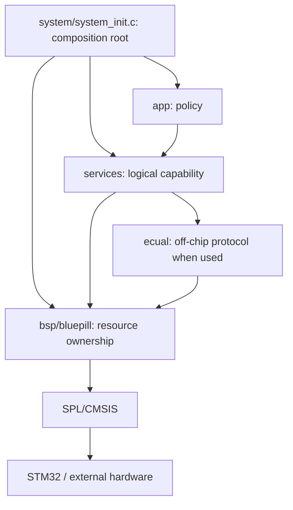
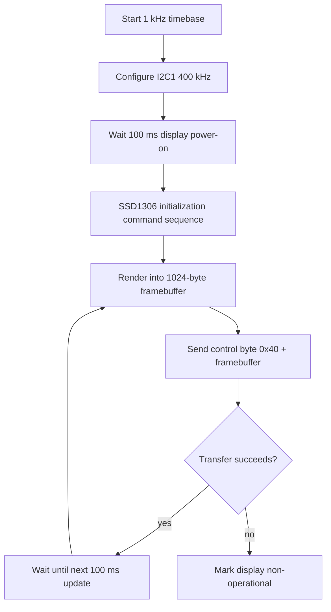

# Architecture — I2C Display — SSD1306

> **Scope:** Internal ownership, dependency direction, initialization, data flow, concurrency, timing, and failure propagation for `06-i2c-display`.

[← Root](../../../README.md) · [↑ Examples](../../README.md) · [← Example README](../README.md) · [Architecture](architecture.md) · [Porting](porting_guide.md)

## Table of contents

- [Architectural objective](#architectural-objective)
- [Layer and source map](#layer-and-source-map)
- [Composition and initialization](#composition-and-initialization)
- [Runtime data flow](#runtime-data-flow)
- [Concurrency contract](#concurrency-contract)
- [Timing and memory reasoning](#timing-and-memory-reasoning)
- [Failure and observability](#failure-and-observability)
- [Extension boundaries](#extension-boundaries)
- [References](#references)

## Architectural objective

This example is not organized around “one source file per peripheral demo.” It keeps the repository's core rule: **Application expresses policy; lower layers own mechanisms and physical resources**. The concrete subject is I2C1 bounded polling, SSD1306 ECUAL protocol, 128×64 static framebuffer, periodic presentation.

The design should remain understandable in both directions:

- reading downward explains how a logical request reaches STM32 hardware;
- reading upward explains how low-level hardware state becomes a bounded, meaningful event/capability for Application.

## Layer and source map

```text
app/src/application.c
  -> display_service + time_service
services/src/display_service.c
  -> ssd1306 ECUAL
ecual/src/ssd1306.c
  -> board_display_bus
bsp/bluepill/src/board_display_bus.c
  -> I2C1 PB6/PB7 + bounded waits
```



The layer checker is part of the architecture contract. A lower-layer implementation can change without authorizing Application to bypass its public Service interface.

## Composition and initialization

The reset path is common to the repository. After `.data/.bss` initialization and `SystemInit()`, `main()` delegates composition to `system_init()`.

For this example the important dependency order is:

```text
board timebase + I2C1 → Time Service → SSD1306/Display Service → Application initial render
```

The order matters because a module should never receive events or invoke a dependency before its state is valid. Peripheral flags are cleared and NVIC lines are configured only after associated storage/state is ready.

## Runtime data flow



Data does not jump directly from an interrupt/peripheral into product policy. Every arrow has an owner and an API boundary. This lets the code document both **lifetime** and **authority** of the state being moved.

## Concurrency contract

SysTick advances time while the main loop performs display transactions. I2C itself is polling/synchronous and has no IRQ/DMA in this example. Transactions are bounded, but a full frame is still a relatively long cooperative operation compared with the earlier examples.

### Key invariants

- SSD1306 protocol code never includes STM32 I2C register/SPL details.
- Board I2C wait loops are bounded and generate/clean up STOP/error state on failure.
- The framebuffer has a single thread-mode owner; there is no concurrent DMA/ISR renderer.
- Application stops presenting after a transfer failure instead of repeatedly issuing traffic to a faulted display.

### Memory and latency

The framebuffer consumes 1024 static bytes, significant but predictable on a 20 KiB SRAM MCU. At 400 kHz the ideal wire time for ~1024 data bytes is already on the order of tens of milliseconds after byte/ACK/control overhead; full-frame updates are therefore a meaningful cooperative-loop workload, not an instantaneous call.

The repository uses `volatile` for state that can change asynchronously, but `volatile` alone is not treated as a lock or a complete synchronization primitive. Where a compound take/clear or block copy must be atomic with respect to an ISR, the code uses a short PRIMASK critical section. Where SPSC ring publication depends on compiler ordering, it uses an explicit compiler barrier.

## Timing and memory reasoning

The project has no heap. Buffers, device state, counters, and Application state are statically or automatically allocated and are therefore visible in the link map.

Clock-dependent behavior is derived from CMSIS/SPL clock state wherever the example needs exact peripheral timing. The normal board configuration is 72 MHz HCLK, 72 MHz PCLK2, 36 MHz PCLK1, with APB1 timers receiving 72 MHz because their bus prescaler is not 1.

The most important timing-specific behavior for this example is described in its [README](../README.md); source constants under `config/` are authoritative.

## Failure and observability

Initialization propagates display/bus failure to `system_init()` and panic. After a successful start, a failed `display_service_present()` latches `s_display_operational=false`; the application does not repeatedly hammer a failing bus.

Initialization failure propagates toward `system_init()` instead of being silently ignored. Runtime diagnostics are deliberately low-overhead: counters, state flags, and GDB-visible globals are preferred to adding a logging subsystem that would change the example's peripheral/concurrency profile.

## Extension boundaries

When extending this example:

1. keep board pin/peripheral mapping in BSP/configuration;
2. keep external-device command semantics in ECUAL when an off-chip device is involved;
3. expose a Service capability rather than an SPL type to Application;
4. keep ISR work bounded and define the publication/ownership rule before writing the handler;
5. update `config/modules.mk` only with the SPL sources actually required;
6. run `make check-layers` before accepting the change;
7. document any new buffer capacity, timeout, drop policy, interrupt priority, or destructive operation.

## References

- [Solomon Systech — SSD1306 product information](https://www.solomon-systech.com/en/product/SSD1306)
- [STMicroelectronics — STM32F103 documentation](https://www.st.com/en/microcontrollers-microprocessors/stm32f103/documentation.html)
- [STMicroelectronics — RM0008: STM32F101/102/103/105/107 reference manual](https://www.st.com/resource/en/reference_manual/cd00171190-stm32f101xx-stm32f102xx-stm32f103xx-advanced-arm-based-32-bit-mcus-stmicroelectronics.pdf)
- [STMicroelectronics — PM0056: STM32F10xxx Cortex-M3 programming manual](https://www.st.com/resource/en/programming_manual/pm0056-stm32f10xxx20xxx21xxxl1xxxx-cortexm3-programming-manual-stmicroelectronics.pdf)
- [Arm — CMSIS Core documentation](https://arm-software.github.io/CMSIS_5/Core/html/index.html)
- [GNU Binutils — linker scripts](https://sourceware.org/binutils/docs/ld/Scripts.html)
- [OpenOCD documentation](https://openocd.org/pages/documentation.html)
- [GDB — remote debugging](https://sourceware.org/gdb/current/onlinedocs/gdb.html/Remote-Debugging.html)


---

[← Root](../../../README.md) · [↑ Examples](../../README.md) · [← Example README](../README.md) · [Architecture](architecture.md) · [Porting](porting_guide.md)
