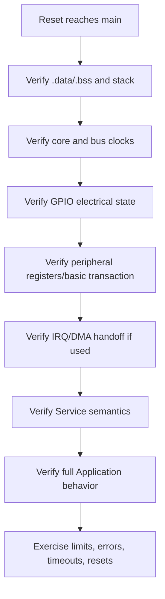

# Porting Guide — I2C Display — SSD1306

> **Scope:** What must be re-validated when `06-i2c-display` moves to another pinout, clock tree, STM32F1 part, board, peripheral instance, or MCU family.

[← Root](../../../README.md) · [↑ Examples](../../README.md) · [← Example README](../README.md) · [Architecture](architecture.md) · [Porting](porting_guide.md)

## Table of contents

- [Porting principle](#porting-principle)
- [Change matrix](#change-matrix)
- [Same MCU, different board](#same-mcu-different-board)
- [Clock and timing re-validation](#clock-and-timing-re-validation)
- [Interrupt and concurrency re-validation](#interrupt-and-concurrency-re-validation)
- [Moving across STM32F1 or MCU families](#moving-across-stm32f1-or-mcu-families)
- [Validation sequence](#validation-sequence)
- [Failure signatures](#failure-signatures)
- [References](#references)

## Porting principle

Port the **lowest layer that actually changed**. Do not move a physical pin number or SPL initialization structure upward simply because a new board is being brought up.

For this example, the stable logical behavior is: I2C1 bounded polling, SSD1306 ECUAL protocol, 128×64 static framebuffer, periodic presentation.

## Change matrix

| Change | Primary review |
|---|---|
| I2C pins/instance | BSP GPIO AF-OD, APB clock, event flags |
| bus rate | pull-ups, capacitance, rise time, device support |
| SSD1306 address | configuration; confirm 7-bit address semantics |
| display geometry/controller | ECUAL framebuffer/addressing/init sequence |
| async transfer | replace BSP transaction engine; preserve ECUAL transport contract |

## Same MCU, different board

Porting separates into two cases: changing only MCU pins/I2C instance should affect BSP; changing the display controller/address/geometry affects ECUAL and configuration. Verify pull-ups, voltage, bus capacitance, I2C rise time, and actual controller compatibility before assuming 400 kHz operation.

A board-only port should normally keep `app/`, most `services/`, `common/`, startup, linker, and SPL/CMSIS unchanged. Review `bsp/bluepill/`, pin mapping, board electrical assumptions, and configuration first. If an off-chip device remains the same, keep ECUAL protocol behavior unchanged and replace only its board-bus transport where possible.

## Clock and timing re-validation

Never preserve a prescaler solely because the MCU name is similar. Verify:

1. oscillator source and `HSE_VALUE`;
2. `SystemInit()` path and measured/observed `SystemCoreClock`;
3. AHB/APB prescalers;
4. APB timer x2 behavior where relevant;
5. peripheral clock source and maximum legal peripheral/device rate;
6. conversion/transfer/debounce/timeout margins after the new clock is known.

For timing-sensitive examples, calculate from clocks first and compare the expected register values with live peripheral registers in GDB.

## Interrupt and concurrency re-validation

When an IRQ is involved, verify all of the following as one contract:

```text
source flag
   -> exact vector-table handler name
   -> NVIC IRQ number/group
   -> priority
   -> flag acknowledgement order
   -> publication into shared state
   -> thread-mode consumption/critical section
```

A port is not complete merely because the interrupt fires. The same ownership/drop/coalescing semantics must still hold.

SysTick advances time while the main loop performs display transactions. I2C itself is polling/synchronous and has no IRQ/DMA in this example. Transactions are bounded, but a full frame is still a relatively long cooperative operation compared with the earlier examples.

## Moving across STM32F1 or MCU families

For another STM32F1 part, review device density define, vector table, Flash/SRAM sizes, peripheral/remap availability, DMA request mapping, and SPL support. For a newer STM32 family, SPL is no longer the natural vendor layer: preserve Application/Service/ECUAL contracts where useful, but replace BSP/vendor initialization, startup/device support, linker memory, clock code, and debug target.

For another CPU architecture, also revisit critical sections, interrupt memory model, startup ABI, compiler flags, and linker conventions. `volatile`, PRIMASK, and Cortex-M exception names are not portable architectural abstractions by themselves.

## Validation sequence

Bring up from the bottom upward:



Run `python3 tools/scripts/check_layers.py` or `make check-layers` after structural changes. Then build, inspect the map/size, flash, and debug at the lowest failing boundary.

## Failure signatures

Useful porting clues:

- code never reaches `main` → startup/vector/linker/reset/clock problem;
- time runs at the wrong rate → core/bus clock or prescaler assumption;
- pin is static/wrong polarity → GPIO clock/mode/mapping or board electrical assumption;
- interrupt flag sets but handler never runs → vector name/NVIC/IRQ grouping;
- handler runs continuously → flag-clear sequence or enable/gating logic;
- data corrupts only under load → ownership, buffer capacity, critical-section, or timing problem;
- external device NACKs/returns bad ID → wiring, voltage, bus mode/rate, address/command semantics;
- behavior works with breakpoints but not at speed → race/timing/timeout or source-impedance/bus-integrity issue.

## References

- [Solomon Systech — SSD1306 product information](https://www.solomon-systech.com/en/product/SSD1306)
- [STMicroelectronics — STM32F103 documentation](https://www.st.com/en/microcontrollers-microprocessors/stm32f103/documentation.html)
- [STMicroelectronics — RM0008: STM32F101/102/103/105/107 reference manual](https://www.st.com/resource/en/reference_manual/cd00171190-stm32f101xx-stm32f102xx-stm32f103xx-advanced-arm-based-32-bit-mcus-stmicroelectronics.pdf)
- [STMicroelectronics — PM0056: STM32F10xxx Cortex-M3 programming manual](https://www.st.com/resource/en/programming_manual/pm0056-stm32f10xxx20xxx21xxxl1xxxx-cortexm3-programming-manual-stmicroelectronics.pdf)
- [Arm — CMSIS Core documentation](https://arm-software.github.io/CMSIS_5/Core/html/index.html)
- [GNU Binutils — linker scripts](https://sourceware.org/binutils/docs/ld/Scripts.html)
- [OpenOCD documentation](https://openocd.org/pages/documentation.html)
- [GDB — remote debugging](https://sourceware.org/gdb/current/onlinedocs/gdb.html/Remote-Debugging.html)


---

[← Root](../../../README.md) · [↑ Examples](../../README.md) · [← Example README](../README.md) · [Architecture](architecture.md) · [Porting](porting_guide.md)
