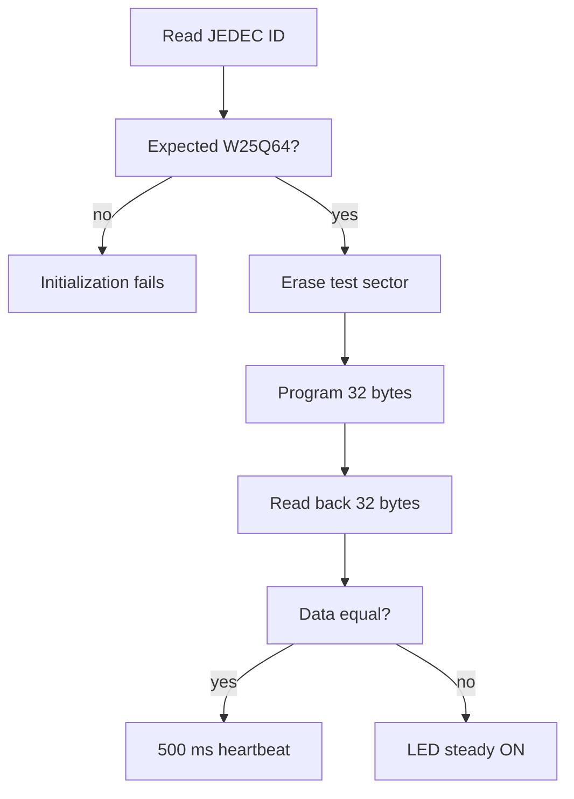

# SPI Memory — W25Q64 NOR Flash

> **Scope:** Example 7 of the repository progression — SPI1 mode 0, software chip select, JEDEC identification, WEL/BUSY state, sector erase/page program/readback self-test.

[Main](https://github.com/haikevins/stm32f1-spl-procedural-baremetal) · [↑ Examples](../README.md) · [← Previous](../06-i2c-display/README.md) · [Next →](../08-adc-dma/README.md) · [Architecture](docs/architecture.md) · [Porting](docs/porting_guide.md)

## Table of contents

- [Purpose and expected behavior](#purpose-and-expected-behavior)
- [Hardware and wiring](#hardware-and-wiring)
- [Configuration](#configuration)
- [Source ownership](#source-ownership)
- [Runtime flow](#runtime-flow)
- [Mechanism in depth](#mechanism-in-depth)
- [Concurrency and ownership](#concurrency-and-ownership)
- [Initialization and failure behavior](#initialization-and-failure-behavior)
- [Build, flash, and debug](#build-flash-and-debug)
- [Design decisions and limitations](#design-decisions-and-limitations)
- [Porting boundary](#porting-boundary)
- [References](#references)

## Purpose and expected behavior

At every reset the demo initializes the flash, validates the JEDEC manufacturer/capacity identity, erases the last 4 KiB sector, programs a fixed 32-byte pattern at the sector start, reads it back, and compares byte-for-byte. Pass is indicated by a 500 ms LED heartbeat; failure leaves the LED steadily on and exposes debug globals describing the stage/IDs/mismatch.

This example remains intentionally small at Application level. The educational value is in the boundary between product policy and the lower-level mechanism: SPI1 mode 0, software chip select, JEDEC identification, WEL/BUSY state, sector erase/page program/readback self-test.

## Hardware and wiring

SPI1 uses PA5 SCK, PA6 MISO, PA7 MOSI, and PA4 as software-controlled chip select. The target is a W25Q64-class 8 MiB 3.3 V NOR flash. PC13 provides visible pass/fail indication.

```text
STM32F103C8T6        W25Q64
--------------------------------
3.3 V       ------- VCC
GND         ------- GND
PA4         ------> CS
PA5/SPI1    ------> CLK
PA6/SPI1    <------ DO / MISO
PA7/SPI1    ------> DI / MOSI
```

SWD uses PA13/PA14 and common ground. The checked-in OpenOCD setup does not require the probe's NRST signal.

## Configuration

| Constant | Value |
|---|---:|
| Flash capacity model | 8 MiB |
| Page | 256 bytes |
| Sector | 4 KiB |
| SPI mode | mode 0 |
| BSP maximum SPI clock | 5 MHz |
| default derived SPI clock | 4.5 MHz at 72 MHz PCLK2 (`/16`) |
| per-byte/status wait timeout | 20 ms |
| page-program ready timeout | 50 ms |
| sector-erase ready timeout | 2000 ms |
| destructive test sector | `0x007FF000` |
| test payload | 32 bytes |
| pass heartbeat | 500 ms |

Compile-time constants live under `config/`; board mappings live under `bsp/bluepill/`. Application source therefore does not duplicate pin numbers, raw peripheral names, or clock-tree formulas.

## Source ownership

```text
app/src/application.c
  -> memory_service + indication_service + time_service
services/src/memory_service.c
  -> w25q64 ECUAL
ecual/src/w25q64.c
  -> board_memory_bus
bsp/bluepill/src/board_memory_bus.c
  -> SPI1 PA5/PA6/PA7 + software CS PA4
```

The dependency direction is checked by `tools/scripts/check_layers.py`. `system/system_init.c` is the composition root and is allowed to connect the layers; Application is not.

## Runtime flow



The reset/startup sequence before this flow is common to every example: custom `Reset_Handler` initializes `.data` and `.bss`, calls vendor `SystemInit()`, then project `main()` calls `system_init()` and enters the cooperative loop.

## Mechanism in depth

### SPI clock selection

SPI1 is on APB2. The BSP selects the first legal STM32 SPI prescaler whose resulting clock does not exceed 5 MHz. At the normal 72 MHz PCLK2, `/8` would be 9 MHz and is rejected; `/16` gives 4.5 MHz and is selected. This derives the bus rate from the actual peripheral clock instead of hard-coding one BR field.

### Safe chip-select startup

PA4 is driven HIGH before/while it becomes an output so the flash starts deselected. SPI uses CPOL low / first-edge capture (mode 0), 8-bit full duplex, and software NSS. Every received byte is clocked by transmitting a byte; reads use `0xFF` dummy data.

### NOR state protocol

The ECUAL driver models commands and state rather than exposing raw SPI calls upward:

```text
0x06  Write Enable
0x05  Read Status Register 1
0x03  Read Data
0x02  Page Program
0x20  4 KiB Sector Erase
0x9F  JEDEC ID
```

Status bit 0 is BUSY; bit 1 is WEL. Program/erase operations wait until not busy, issue WREN, verify WEL, send the operation, then poll BUSY with an operation-specific bound. Page program rejects zero length, data beyond 256 bytes, address overflow, and crossing a page boundary. Sector erase aligns the supplied address down to a 4 KiB sector start.

### Transaction blocking versus unbounded blocking

The design is synchronous in thread mode: a sector erase can occupy the cooperative loop while BUSY remains asserted. The important safety distinction is that every wait is bounded. This is acceptable for a focused NOR demo but would need an asynchronous state machine or scheduler integration in latency-sensitive firmware.

### Destructive-test boundary

`0x007FF000` is the last sector in the modeled 8 MiB device and is erased on every reset. It must not contain data that a user intends to preserve.

## Concurrency and ownership

SPI is polling/thread-mode only; SysTick continues to interrupt so timeouts and heartbeat time remain valid. There is no bus arbitration because this example has one SPI client.

The general repository rule still holds: the lowest layer that owns an interrupt source acknowledges/publishes hardware state, while Services/Application consume that state outside the ISR unless a truly low-level bounded operation is required.

## Initialization and failure behavior

Initialization order:

```text
board timebase + LED + SPI1 → Services → W25Q64 init/JEDEC validation → destructive Application self-test
```

Application exports JEDEC IDs, stage pass flags, error count, first mismatch index, and first/last readback bytes as GDB-friendly globals. The demo validates manufacturer `0xEF` and capacity `0x17`; it intentionally does not require one specific memory-type byte.

`main()` treats a failed `system_init()` as fatal and calls `system_panic()`, which disables interrupts and remains in a debug-friendly halt loop.

## Build, flash, and debug

```bash
make check-layers
make clean
make
```

The build creates `build/firmware.elf`, `.hex`, `.bin`, `.lst`, dependency files, and a linker map. Useful targets are:

```bash
make size
make tree
make flash
make erase
make debug-server
make debug
```

`make all` runs the architectural layer checker before compilation. The Makefile targets Cortex-M3/Thumb, compiles C11 with `-Og -g3`, places each function/data object in its own section, links with the project linker script, enables linker garbage collection, and deliberately uses `-nostartfiles -nostdlib`. Only compiler runtime support (`-lgcc`) is linked explicitly.

The repository uses ST-Link/SWD with OpenOCD and GDB. `tools/openocd/bluepill_stlink.cfg` selects the ST-Link interface, SWD transport, the STM32F1 target, a conservative 1 MHz adapter rate, and `reset_config none`. That reset policy is intentional for boards where NRST is not wired to the probe.

A typical two-terminal session is:

```bash
# Terminal 1
make debug-server

# Terminal 2
make debug
```

The checked-in GDB command file connects to `localhost:3333`, halts/resets the target, loads the ELF, sets a breakpoint at `main`, and continues. The ELF retains source-level debug information because the default optimization is `-Og` with `-g3`.

For this example, inspect its public Application/Service variables and peripheral registers in GDB rather than adding unrelated logging dependencies simply for observation.

## Design decisions and limitations

- The self-test is intentionally destructive and unsuitable for a sector containing persistent application data.
- No wear leveling, filesystem, SFDP discovery, or power-fail transaction layer is implemented.
- No >16 MiB/4-byte address support is needed for W25Q64.
- Synchronous erase is simple but can block thread mode for a long interval.

These are documented constraints of the example, not claims that the mechanism is universally optimal.

## Porting boundary

For another SPI flash, do not assume command set/status bits/page size/erase geometry or JEDEC capacity encoding are identical. If the device stays W25Q64 but the board changes, isolate changes to BSP pin/SPI clock/CS ownership where possible.

See [the detailed porting guide](docs/porting_guide.md) for the change matrix and validation order.

## References

- [Winbond — W25Q64 product search/documentation](https://www.winbond.com/hq/search/?__locale=en&q=W25Q64JV)
- [STMicroelectronics — STM32F103 documentation](https://www.st.com/en/microcontrollers-microprocessors/stm32f103/documentation.html)
- [STMicroelectronics — RM0008: STM32F101/102/103/105/107 reference manual](https://www.st.com/resource/en/reference_manual/cd00171190-stm32f101xx-stm32f102xx-stm32f103xx-advanced-arm-based-32-bit-mcus-stmicroelectronics.pdf)
- [STMicroelectronics — PM0056: STM32F10xxx Cortex-M3 programming manual](https://www.st.com/resource/en/programming_manual/pm0056-stm32f10xxx20xxx21xxxl1xxxx-cortexm3-programming-manual-stmicroelectronics.pdf)
- [Arm — CMSIS Core documentation](https://arm-software.github.io/CMSIS_5/Core/html/index.html)
- [GNU Binutils — linker scripts](https://sourceware.org/binutils/docs/ld/Scripts.html)
- [OpenOCD documentation](https://openocd.org/pages/documentation.html)
- [GDB — remote debugging](https://sourceware.org/gdb/current/onlinedocs/gdb.html/Remote-Debugging.html)


---

[Main](https://github.com/haikevins/stm32f1-spl-procedural-baremetal) · [↑ Examples](../README.md) · [← Previous](../06-i2c-display/README.md) · [Next →](../08-adc-dma/README.md) · [Architecture](docs/architecture.md) · [Porting](docs/porting_guide.md)
