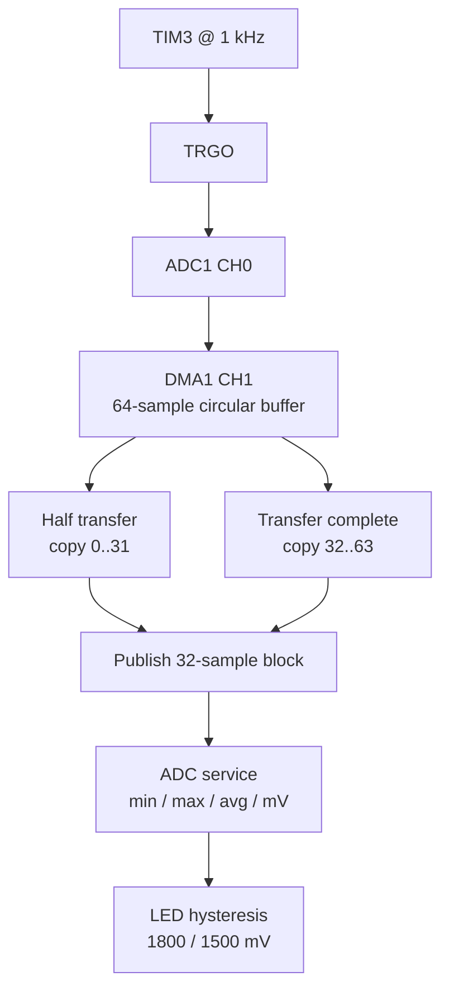

# ADC + DMA — Timer-Triggered Sample Pipeline

> **Scope:** Example 8 of the repository progression — TIM3 TRGO at 1 kHz, ADC1 channel 0, DMA1 Channel 1 circular buffer, half/full ISR block handoff, measurement processing and LED hysteresis.

[Main](https://github.com/haikevins/stm32f1-spl-procedural-baremetal) · [↑ Examples](../README.md) · [← Previous](../07-spi-memory/README.md) · [Architecture](docs/architecture.md) · [Porting](docs/porting_guide.md)

## Table of contents

- [Purpose and expected behavior](#purpose-and-expected-behavior)
- [Hardware and wiring](#hardware-and-wiring)
- [Configuration](#configuration)
- [Source ownership](#source-ownership)
- [Runtime flow](#runtime-flow)
- [Mechanism in depth](#mechanism-in-depth)
- [Concurrency and ownership](#concurrency-and-ownership)
- [Initialization and failure behavior](#initialization-and-failure-behavior)
- [Build, flash, and debug](#build-flash-and-debug)
- [Design decisions and limitations](#design-decisions-and-limitations)
- [Porting boundary](#porting-boundary)
- [References](#references)

## Purpose and expected behavior

TIM3 TRGO initiates one ADC1 conversion each millisecond. DMA circularly stores the result. Half-transfer and transfer-complete interrupts copy one 32-sample half into a staging block and publish “latest block ready.” Thread mode atomically takes that block, computes rounded average/min/max/millivolts, publishes a measurement, and drives PC13 with 300 mV hysteresis.

This example remains intentionally small at Application level. The educational value is in the boundary between product policy and the lower-level mechanism: TIM3 TRGO at 1 kHz, ADC1 channel 0, DMA1 Channel 1 circular buffer, half/full ISR block handoff, measurement processing and LED hysteresis.

## Hardware and wiring

PA0 is configured as analog ADC1_IN0. TIM3 generates the ADC trigger; DMA1 Channel 1 moves ADC DR samples to RAM. PC13 is the active-low status LED. A potentiometer or other 0..3.3 V source can drive PA0 for testing.

```text
3.3 V ---- potentiometer ---- GND
                  |
                  +---- PA0 / ADC1_IN0

PC13 ---- onboard active-low LED
```

SWD uses PA13/PA14 and common ground. The checked-in OpenOCD setup does not require the probe's NRST signal.

## Configuration

| Constant | Value |
|---|---:|
| ADC reference model | 3300 mV |
| full-scale raw value | 4095 |
| sample rate | 1000 samples/s |
| trigger timer tick | 1 MHz |
| DMA circular storage | 64 × 16-bit samples |
| publication block | 32 samples |
| ADC calibration loop bound | 1,000,000 iterations |
| LED ON threshold | 1800 mV |
| LED OFF threshold | 1500 mV |
| DMA NVIC priority | preemption 1, subpriority 0 |

Compile-time constants live under `config/`; board mappings live under `bsp/bluepill/`. Application source therefore does not duplicate pin numbers, raw peripheral names, or clock-tree formulas.

## Source ownership

```text
app/src/application.c
  -> adc_service + indication_service
services/src/adc_service.c
  -> board_adc_dma block API
bsp/bluepill/src/board_adc_dma.c
  -> TIM3 TRGO + ADC1 + DMA1 CH1 ISR
```

The dependency direction is checked by `tools/scripts/check_layers.py`. `system/system_init.c` is the composition root and is allowed to connect the layers; Application is not.

## Runtime flow



The reset/startup sequence before this flow is common to every example: custom `Reset_Handler` initializes `.data` and `.bss`, calls vendor `SystemInit()`, then project `main()` calls `system_init()` and enters the cooperative loop.

## Mechanism in depth

### Trigger chain and rates

The BSP derives the TIM3 clock using the APB1 timer x2 rule, configures a 1 MHz counter tick, and programs the update rate to 1 kHz. Timer update/TRGO therefore paces ADC acquisition in hardware; super-loop jitter does not move individual sample instants.

ADC1 runs from PCLK2 divided by six under the example clock configuration, yielding about 12 MHz at the normal 72 MHz PCLK2. A 55.5-cycle sample time plus conversion overhead is comfortably shorter than the 1 ms trigger interval.

### Circular DMA ownership

DMA writes a 64-element `uint16_t` circular buffer. HT fires after samples 0..31; TC fires after samples 32..63. The ISR copies the completed half into a separate 32-sample staging array. That copy is a deliberate ownership simplification: thread mode never processes memory while DMA may be rewriting the same half.

### One-slot latest-block policy

If a previous staging block is still pending when another half completes, the overrun counter increments and the newly completed block overwrites the staging slot. The semantic is therefore **latest block wins**, not lossless queued acquisition. At 1000 samples/s, a 32-sample block spans 32 ms, so thread mode must normally consume faster than one block interval to avoid loss.

`board_adc_dma_take_sample_block()` masks interrupts with PRIMASK while copying the 32-sample staging block to the caller and clearing the ready flag. This creates an unambiguous handoff at the cost of briefly delaying interrupts during the copy.

### Measurement reduction

The Service calculates minimum, maximum, sum, rounded average, and millivolts. The voltage conversion is integer arithmetic:

```text
mV = (average_raw * 3300 + 4095/2) / 4095
```

Application exposes measurement sequence, raw statistics, millivolts, DMA overruns, and DMA errors as globals so they can be inspected from GDB without adding a UART dependency.

### LED hysteresis state

```text
LED OFF -- measurement >= 1800 mV --> LED ON
LED ON  -- measurement <= 1500 mV --> LED OFF

1500 mV < measurement < 1800 mV
    -> retain the previous LED state
```

### Hysteresis

The LED turns on only at/above 1800 mV and turns off only at/below 1500 mV. Values in between retain the previous state, preventing chatter around one exact threshold.

## Concurrency and ownership

TIM3 and ADC run autonomously; DMA is the producer; DMA ISR publishes completed blocks; thread mode consumes/processes them. The design explicitly separates hardware sample timing from software processing latency.

The general repository rule still holds: the lowest layer that owns an interrupt source acknowledges/publishes hardware state, while Services/Application consume that state outside the ISR unless a truly low-level bounded operation is required.

## Initialization and failure behavior

Initialization order:

```text
board LED + TIM3/ADC1/DMA1 pipeline → ADC/Indication Services → Application; timer starts hardware acquisition after configuration
```

DMA transfer-error interrupts increment an error counter. Publication overwrite increments an overrun counter. ADC calibration is bounded by iteration count during init. The demo does not automatically restart a failed DMA/ADC pipeline after a runtime error.

`main()` treats a failed `system_init()` as fatal and calls `system_panic()`, which disables interrupts and remains in a debug-friendly halt loop.

## Build, flash, and debug

```bash
make check-layers
make clean
make
```

The build creates `build/firmware.elf`, `.hex`, `.bin`, `.lst`, dependency files, and a linker map. Useful targets are:

```bash
make size
make tree
make flash
make erase
make debug-server
make debug
```

`make all` runs the architectural layer checker before compilation. The Makefile targets Cortex-M3/Thumb, compiles C11 with `-Og -g3`, places each function/data object in its own section, links with the project linker script, enables linker garbage collection, and deliberately uses `-nostartfiles -nostdlib`. Only compiler runtime support (`-lgcc`) is linked explicitly.

The repository uses ST-Link/SWD with OpenOCD and GDB. `tools/openocd/bluepill_stlink.cfg` selects the ST-Link interface, SWD transport, the STM32F1 target, a conservative 1 MHz adapter rate, and `reset_config none`. That reset policy is intentional for boards where NRST is not wired to the probe.

A typical two-terminal session is:

```bash
# Terminal 1
make debug-server

# Terminal 2
make debug
```

The checked-in GDB command file connects to `localhost:3333`, halts/resets the target, loads the ELF, sets a breakpoint at `main`, and continues. The ELF retains source-level debug information because the default optimization is `-Og` with `-g3`.

For this example, inspect its public Application/Service variables and peripheral registers in GDB rather than adding unrelated logging dependencies simply for observation.

## Design decisions and limitations

- ISR copying 32 samples is simple and safe but costs interrupt time; ping-pong buffer ownership could avoid the copy with more state complexity.
- One-slot publication intentionally prioritizes freshness over lossless history.
- The 3300 mV reference is a configuration assumption, not a calibrated VDDA measurement.
- Average/min/max are block statistics, not filtering across multiple blocks.

These are documented constraints of the example, not claims that the mechanism is universally optimal.

## Porting boundary

ADC and DMA mappings are device-specific. Re-verify channel-to-pin mapping, ADC clock limit, sample time/source impedance, timer TRGO selection, DMA channel mapping, transfer width, IRQ flags, VDDA/reference, and trigger rate on every MCU/board change.

See [the detailed porting guide](docs/porting_guide.md) for the change matrix and validation order.

## References

- [STMicroelectronics — STM32F103 documentation](https://www.st.com/en/microcontrollers-microprocessors/stm32f103/documentation.html)
- [STMicroelectronics — RM0008: STM32F101/102/103/105/107 reference manual](https://www.st.com/resource/en/reference_manual/cd00171190-stm32f101xx-stm32f102xx-stm32f103xx-advanced-arm-based-32-bit-mcus-stmicroelectronics.pdf)
- [STMicroelectronics — PM0056: STM32F10xxx Cortex-M3 programming manual](https://www.st.com/resource/en/programming_manual/pm0056-stm32f10xxx20xxx21xxxl1xxxx-cortexm3-programming-manual-stmicroelectronics.pdf)
- [Arm — CMSIS Core documentation](https://arm-software.github.io/CMSIS_5/Core/html/index.html)
- [GNU Binutils — linker scripts](https://sourceware.org/binutils/docs/ld/Scripts.html)
- [OpenOCD documentation](https://openocd.org/pages/documentation.html)
- [GDB — remote debugging](https://sourceware.org/gdb/current/onlinedocs/gdb.html/Remote-Debugging.html)


---

[Main](https://github.com/haikevins/stm32f1-spl-procedural-baremetal) · [↑ Examples](../README.md) · [← Previous](../07-spi-memory/README.md) · [Architecture](docs/architecture.md) · [Porting](docs/porting_guide.md)
