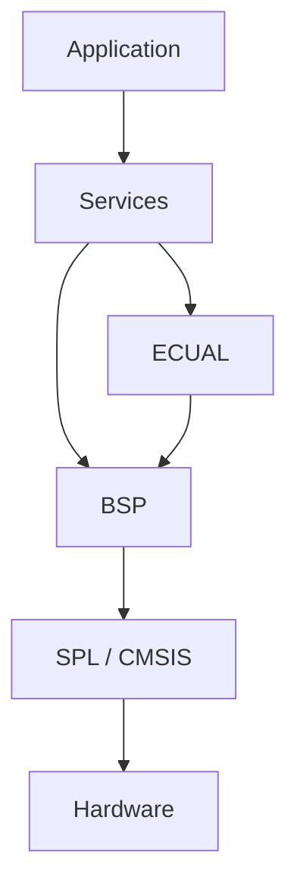

# Architecture — ADC + DMA — Timer-Triggered Sample Pipeline

> **Scope:** Internal ownership, dependency direction, initialization, data flow, concurrency, timing, and failure propagation for `08-adc-dma`.

[Main](https://github.com/haikevins/stm32f1-spl-procedural-baremetal) · [↑ Examples](../../README.md) · [← Example README](../README.md) · [Architecture](architecture.md) · [Porting](porting_guide.md)

## Table of contents

- [Architectural objective](#architectural-objective)
- [Layer and source map](#layer-and-source-map)
- [Composition and initialization](#composition-and-initialization)
- [Runtime data flow](#runtime-data-flow)
- [Concurrency contract](#concurrency-contract)
- [Timing and memory reasoning](#timing-and-memory-reasoning)
- [Failure and observability](#failure-and-observability)
- [Extension boundaries](#extension-boundaries)
- [References](#references)

## Architectural objective

This example is not organized around “one source file per peripheral demo.” It keeps the repository's core rule: **Application expresses policy; lower layers own mechanisms and physical resources**. The concrete subject is TIM3 TRGO at 1 kHz, ADC1 channel 0, DMA1 Channel 1 circular buffer, half/full ISR block handoff, measurement processing and LED hysteresis.

The design should remain understandable in both directions:

- reading downward explains how a logical request reaches STM32 hardware;
- reading upward explains how low-level hardware state becomes a bounded, meaningful event/capability for Application.

## Layer and source map

```text
app/src/application.c
  -> adc_service + indication_service
services/src/adc_service.c
  -> board_adc_dma block API
bsp/bluepill/src/board_adc_dma.c
  -> TIM3 TRGO + ADC1 + DMA1 CH1 ISR
```



The layer checker is part of the architecture contract. A lower-layer implementation can change without authorizing Application to bypass its public Service interface.

## Composition and initialization

The reset path is common to the repository. After `.data/.bss` initialization and `SystemInit()`, `main()` delegates composition to `system_init()`.

For this example the important dependency order is:

```text
board LED + TIM3/ADC1/DMA1 pipeline → ADC/Indication Services → Application; timer starts hardware acquisition after configuration
```

The order matters because a module should never receive events or invoke a dependency before its state is valid. Peripheral flags are cleared and NVIC lines are configured only after associated storage/state is ready.

## Runtime data flow

```text
TIM3 TRGO (1 kHz)
      ↓
ADC1 channel 0
      ↓
DMA1 CH1 circular buffer
      ├── HT: copy samples 0..31
      └── TC: copy samples 32..63
      ↓
one 32-sample staging block
      ↓
thread-mode min / max / average / mV
      ↓
Application diagnostics + LED hysteresis
```

Data does not jump directly from an interrupt/peripheral into product policy. Every arrow has an owner and an API boundary. This lets the code document both **lifetime** and **authority** of the state being moved.

## Concurrency contract

TIM3 and ADC run autonomously; DMA is the producer; DMA ISR publishes completed blocks; thread mode consumes/processes them. The design explicitly separates hardware sample timing from software processing latency.

### Key invariants

- TIM3, not software, defines sample instants.
- DMA owns the 64-sample circular acquisition buffer.
- ISR copies only a completed half; it never processes samples numerically.
- One staging block is either pending or free; a new completion overwrites old pending data and increments overrun.
- Thread mode copies the staging block under a short PRIMASK critical section before computation.
- Application hysteresis thresholds satisfy OFF < ON at compile time.

### Rate reasoning

One 32-sample half is produced every 32 ms. The system receives alternating HT/TC events at 31.25 blocks/s total. The thread path therefore has a clear service deadline: normally consume within one block period if no overrun is desired.

The repository uses `volatile` for state that can change asynchronously, but `volatile` alone is not treated as a lock or a complete synchronization primitive. Where a compound take/clear or block copy must be atomic with respect to an ISR, the code uses a short PRIMASK critical section. Where SPSC ring publication depends on compiler ordering, it uses an explicit compiler barrier.

## Timing and memory reasoning

The project has no heap. Buffers, device state, counters, and Application state are statically or automatically allocated and are therefore visible in the link map.

Clock-dependent behavior is derived from CMSIS/SPL clock state wherever the example needs exact peripheral timing. The normal board configuration is 72 MHz HCLK, 72 MHz PCLK2, 36 MHz PCLK1, with APB1 timers receiving 72 MHz because their bus prescaler is not 1.

The most important timing-specific behavior for this example is described in its [README](../README.md); source constants under `config/` are authoritative.

## Failure and observability

DMA transfer-error interrupts increment an error counter. Publication overwrite increments an overrun counter. ADC calibration is bounded by iteration count during init. The demo does not automatically restart a failed DMA/ADC pipeline after a runtime error.

Initialization failure propagates toward `system_init()` instead of being silently ignored. Runtime diagnostics are deliberately low-overhead: counters, state flags, and GDB-visible globals are preferred to adding a logging subsystem that would change the example's peripheral/concurrency profile.

## Extension boundaries

When extending this example:

1. keep board pin/peripheral mapping in BSP/configuration;
2. keep external-device command semantics in ECUAL when an off-chip device is involved;
3. expose a Service capability rather than an SPL type to Application;
4. keep ISR work bounded and define the publication/ownership rule before writing the handler;
5. update `config/modules.mk` only with the SPL sources actually required;
6. run `make check-layers` before accepting the change;
7. document any new buffer capacity, timeout, drop policy, interrupt priority, or destructive operation.

## References

- [STMicroelectronics — STM32F103 documentation](https://www.st.com/en/microcontrollers-microprocessors/stm32f103/documentation.html)
- [STMicroelectronics — RM0008: STM32F101/102/103/105/107 reference manual](https://www.st.com/resource/en/reference_manual/cd00171190-stm32f101xx-stm32f102xx-stm32f103xx-advanced-arm-based-32-bit-mcus-stmicroelectronics.pdf)
- [STMicroelectronics — PM0056: STM32F10xxx Cortex-M3 programming manual](https://www.st.com/resource/en/programming_manual/pm0056-stm32f10xxx20xxx21xxxl1xxxx-cortexm3-programming-manual-stmicroelectronics.pdf)
- [Arm — CMSIS Core documentation](https://arm-software.github.io/CMSIS_5/Core/html/index.html)
- [GNU Binutils — linker scripts](https://sourceware.org/binutils/docs/ld/Scripts.html)
- [OpenOCD documentation](https://openocd.org/pages/documentation.html)
- [GDB — remote debugging](https://sourceware.org/gdb/current/onlinedocs/gdb.html/Remote-Debugging.html)


---

[Main](https://github.com/haikevins/stm32f1-spl-procedural-baremetal) · [↑ Examples](../../README.md) · [← Example README](../README.md) · [Architecture](architecture.md) · [Porting](porting_guide.md)
