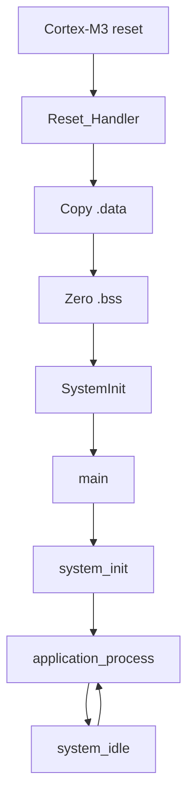

# STM32F103C8T6 SPL Bare-Metal Project Template

> **Scope:** Reusable skeleton extracted from the example architecture. It provides startup, linker, build/debug tooling, dependency enforcement, a composition root, and empty/near-empty project layers so a new peripheral project begins with explicit ownership rather than a monolithic `main.c`.

[← Root README](../README.md) · [Examples](../examples/README.md) · [Architecture](docs/architecture.md) · [Adding a module](docs/adding_a_module.md) · [Porting guide](docs/porting_guide.md)

## Table of contents

- [Purpose](#purpose)
- [What the template already owns](#what-the-template-already-owns)
- [Directory contract](#directory-contract)
- [Reset and runtime](#reset-and-runtime)
- [Layer rules](#layer-rules)
- [Build and debug](#build-and-debug)
- [Starting a new project](#starting-a-new-project)
- [Current template caveat](#current-template-caveat)
- [References](#references)

## Purpose

The template is not a hardware abstraction framework. It is a **project ownership scaffold**. It answers the questions that are easy to postpone in a small demo and expensive to repair later:

- Who owns reset/startup and memory initialization?
- Where do physical pins and peripheral instances live?
- How does Application avoid depending on SPL/CMSIS?
- Where does an off-chip protocol driver belong?
- Who decides initialization order?
- How are interrupt publication and shared-state ownership documented?
- How can the repository automatically reject forbidden include dependencies?

The eight [examples](../examples/README.md) are concrete reference implementations of those answers.

## What the template already owns

| Concern | Template component |
|---|---|
| Vector table/reset | `startup/startup_stm32f10x_md.S` |
| Flash/SRAM sections | `linker/stm32f103c8t6.ld` |
| Vendor clock setup | bundled CMSIS `system_stm32f10x.c` |
| `main()` lifecycle | `system/main.c` |
| Composition | `system/system_init.c` |
| Panic/idle policy | `system/system_fault.c`, `system/system_control.c` |
| Board root | `bsp/bluepill/` |
| Product policy | `app/` |
| Logical capabilities | `services/` |
| External devices | `ecual/` |
| Portable helpers | `common/` |
| Compile-time policy | `config/` |
| Layer enforcement | `tools/scripts/check_layers.py` |
| Flash/debug | `tools/openocd/`, `tools/gdb/` |

## Directory contract

```text
app/                    highest-level policy
services/               hardware-independent capability APIs
 ecual/                  external-component/device protocols
bsp/bluepill/           physical board/peripheral ownership
common/                 portable types/utilities
config/                 compile-time constants + SPL module list
system/                 composition root + runtime entry/control
platform/               CPU/platform extension point
runtime/                runtime extension point
startup/                reset/vector table
linker/                 memory layout
third_party/            SPL + CMSIS
 tools/                  architectural/build/debug support
tests/                  host-side tests/extensions
```

The placeholders are intentional. Do not create a layer merely to fill a folder; add a module only when it has a real ownership responsibility.

## Reset and runtime



The template's `system_idle()` uses `__WFI()` as a low-power-oriented placeholder, unlike the completed examples' `__NOP()` debug-friendly idle. A production WFI policy must ensure that the check-for-work and sleep transition cannot lose a wake-up event.

The template panic path disables interrupts and executes `__WFI()`. With interrupts masked, that is effectively intended as a halt; do not treat it as a recoverable sleep state.

## Layer rules

`check_layers.py` enforces include direction. The practical rule is:

```text
Application -> Services -> BSP / ECUAL -> vendor hardware APIs
```

`System` is the controlled exception because it is the composition root. `Common` must remain portable. SPL initialization structures should not leak into Service/Application public APIs.

See [Architecture](docs/architecture.md) for the exact rationale and handoff patterns.

## Build and debug

```bash
make check-layers
make clean
make
```

The build creates `build/firmware.elf`, `.hex`, `.bin`, `.lst`, dependency files, and a linker map. Useful targets are:

```bash
make size
make tree
make flash
make erase
make debug-server
make debug
```

`make all` runs the architectural layer checker before compilation. The Makefile targets Cortex-M3/Thumb, compiles C11 with `-Og -g3`, places each function/data object in its own section, links with the project linker script, enables linker garbage collection, and deliberately uses `-nostartfiles -nostdlib`. Only compiler runtime support (`-lgcc`) is linked explicitly.

The repository uses ST-Link/SWD with OpenOCD and GDB. `tools/openocd/bluepill_stlink.cfg` selects the ST-Link interface, SWD transport, the STM32F1 target, a conservative 1 MHz adapter rate, and `reset_config none`. That reset policy is intentional for boards where NRST is not wired to the probe.

A typical two-terminal session is:

```bash
# Terminal 1
make debug-server

# Terminal 2
make debug
```

The checked-in GDB command file connects to `localhost:3333`, halts/resets the target, loads the ELF, sets a breakpoint at `main`, and continues. The ELF retains source-level debug information because the default optimization is `-Og` with `-g3`.

The linker is freestanding and heap-free; the default build retains source debug information and emits ELF/HEX/BIN/LST/MAP artifacts.

## Starting a new project

A disciplined sequence is:

1. copy the template to a new project directory;
2. define the hardware/software requirement without naming an SPL call;
3. decide ownership: Application, Service, BSP, ECUAL, or Common;
4. add only the required SPL module source in `config/modules.mk`;
5. map pins/peripherals in BSP/configuration;
6. design polling/interrupt/DMA handoff before implementing ISR code;
7. wire initialization in `system_init()` from dependencies upward;
8. run `make check-layers`;
9. build and inspect linker memory usage;
10. validate from startup/clock upward on hardware;
11. document capacities, timeouts, priorities, drop policies, and destructive behavior.

The detailed checklist is in [Adding a module](docs/adding_a_module.md).

## Current template caveat

On the current repository snapshot, the template file is named:

```text
linker/stm32f103c8t6.ld
```

while the template Makefile refers to:

```text
linker/STM32F103C8T6.ld
```

Linux and other case-sensitive filesystems treat those as different paths, so align the filename/reference before building a new project from the template. The eight completed examples already store the uppercase filename expected by their Makefiles.

## References

- [STMicroelectronics — STM32F103 documentation](https://www.st.com/en/microcontrollers-microprocessors/stm32f103/documentation.html)
- [STMicroelectronics — RM0008: STM32F101/102/103/105/107 reference manual](https://www.st.com/resource/en/reference_manual/cd00171190-stm32f101xx-stm32f102xx-stm32f103xx-advanced-arm-based-32-bit-mcus-stmicroelectronics.pdf)
- [STMicroelectronics — PM0056: STM32F10xxx Cortex-M3 programming manual](https://www.st.com/resource/en/programming_manual/pm0056-stm32f10xxx20xxx21xxxl1xxxx-cortexm3-programming-manual-stmicroelectronics.pdf)
- [Arm — CMSIS Core documentation](https://arm-software.github.io/CMSIS_5/Core/html/index.html)
- [GNU Binutils — linker scripts](https://sourceware.org/binutils/docs/ld/Scripts.html)
- [OpenOCD documentation](https://openocd.org/pages/documentation.html)
- [GDB — remote debugging](https://sourceware.org/gdb/current/onlinedocs/gdb.html/Remote-Debugging.html)
