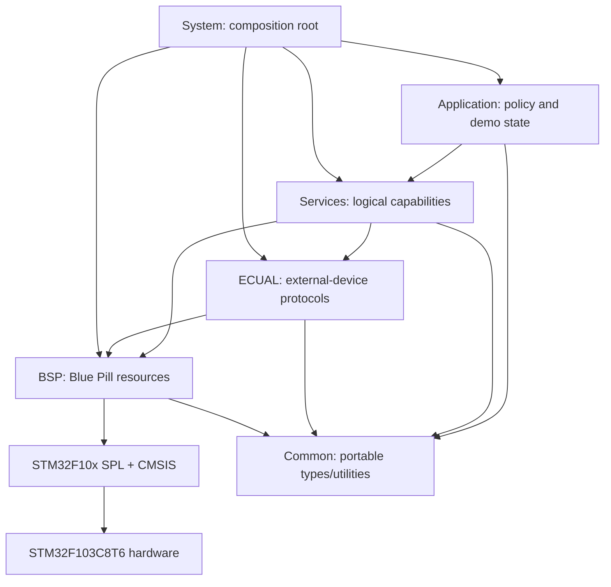
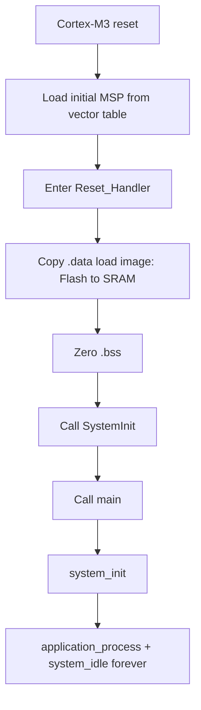

# STM32F1 SPL Procedural Bare-Metal

> **Scope:** A progressive STM32F103C8T6 firmware repository for learning explicit startup, linker/runtime ownership, SPL-based peripheral control, interrupt handoff, cooperative super-loop design, and layered embedded-software architecture without HAL, an RTOS, or dynamic allocation.

[Examples](examples/README.md) · [Reusable template](template/README.md) · [Template architecture](template/docs/architecture.md) · [Adding a module](template/docs/adding_a_module.md) · [Porting guide](template/docs/porting_guide.md)

## Table of contents

- [Project intent](#project-intent)
- [Technical baseline](#technical-baseline)
- [Repository map](#repository-map)
- [Architecture and dependency rules](#architecture-and-dependency-rules)
- [Reset, startup, and C runtime](#reset-startup-and-c-runtime)
- [Memory model and linker contract](#memory-model-and-linker-contract)
- [Clock model](#clock-model)
- [Runtime and concurrency model](#runtime-and-concurrency-model)
- [Example progression](#example-progression)
- [Build, flash, and debug](#build-flash-and-debug)
- [Design decisions and limitations](#design-decisions-and-limitations)
- [References](#references)

## Project intent

This repository is deliberately **procedural bare-metal firmware**. It uses the legacy STM32F10x Standard Peripheral Library (SPL) as the peripheral register-access layer and CMSIS for Cortex-M3/core support, but it keeps lifecycle and ownership under project control.

The repository intentionally does **not** use:

- STM32 HAL or LL;
- Arduino or a framework-owned runtime;
- an RTOS or hidden scheduler;
- heap allocation;
- libc startup files;
- application code that reaches directly into SPL/CMSIS/device registers.

The point is not to prove that SPL is newer or better than modern STM32 libraries. The point is to expose the mechanisms that remain relevant regardless of vendor API: vector-table ownership, `.data/.bss` initialization, clock derivation, peripheral resource ownership, interrupt-to-thread handoff, bounded work, static memory, and dependency direction.

## Technical baseline

| Area | Repository choice |
|---|---|
| MCU | STM32F103C8T6, medium-density STM32F1 |
| Board | Blue Pill |
| CPU | Arm Cortex-M3, Thumb |
| Flash model | 64 KiB at `0x08000000` |
| SRAM model | 20 KiB at `0x20000000` |
| HSE definition | 8 MHz |
| Normal vendor clock configuration | 72 MHz SYSCLK/HCLK, 72 MHz PCLK2, 36 MHz PCLK1 |
| Language | C11 + GNU assembler with C preprocessor |
| Peripheral API | STM32F10x SPL |
| Core/device API | legacy CMSIS bundled in `third_party/` |
| Runtime | custom startup + linker + super-loop |
| Allocation | static/automatic only; linker heap size is zero |
| Build | GNU Make + `arm-none-eabi-*` |
| Debug | ST-Link + SWD + OpenOCD + GDB |

## Repository map

```text
stm32f1-spl-procedural-baremetal/
├── README.md
├── examples/
│   ├── README.md
│   ├── 01-blink-led/
│   ├── 02-gpio-input-interrupt/
│   ├── 03-uart-polling/
│   ├── 04-uart-interrupt-ring-buffer/
│   ├── 05-timer-pwm/
│   ├── 06-i2c-display/
│   ├── 07-spi-memory/
│   └── 08-adc-dma/
└── template/
    ├── README.md
    └── docs/
```

Every complete project uses the same structural vocabulary:

```text
app/         product/demo policy
services/    hardware-independent capabilities
bsp/         Blue Pill resource ownership
 ecual/      off-chip device protocol drivers
common/      portable utilities and shared types
config/      compile-time policy/constants
system/      composition root, main loop, panic
platform/    architecture/platform-specific extension point
runtime/     runtime extension point
startup/     vector table + Reset_Handler
linker/      memory map and section placement
third_party/ SPL + CMSIS
 tools/      layer check, OpenOCD, GDB
 tests/      host-side test extension point
```

## Architecture and dependency rules



The direction is enforced by `tools/scripts/check_layers.py`, not just documented as an aspiration. The checker parses project includes and rejects dependencies outside the allowed matrix. In practical terms:

- `app/` may depend on Application-facing Services, Common, and configuration, but not BSP, ECUAL, SPL, CMSIS, or raw device headers.
- `services/` may depend on BSP/ECUAL/Common/configuration, but must not depend upward on Application.
- `ecual/` owns off-chip protocol semantics and reaches hardware through board/bus APIs rather than importing Application policy.
- `bsp/` is the lowest first-party hardware layer and may use SPL/CMSIS/vendor definitions.
- `system/` is intentionally privileged: it composes modules and therefore may include their public APIs.

That separation makes a useful distinction between **what a peripheral can do** and **why the application wants it done**.

## Reset, startup, and C runtime

The project does not delegate reset handling to a vendor IDE startup package. `startup/startup_stm32f10x_md.S` owns the medium-density vector table and reset path.



The reset sequence establishes the minimum C execution contract:

1. initialized globals/statics in `.data` receive their Flash initial values;
2. zero-initialized globals/statics in `.bss` become zero;
3. vendor `SystemInit()` configures the clock tree;
4. project `main()` becomes the explicit runtime owner.

Unused handlers are weak aliases to `Default_Handler`; a peripheral module replaces one by defining the exact strong handler name present in the vector table.

## Memory model and linker contract

The linker script models the STM32F103C8T6 as:

```text
Flash  0x08000000  64 KiB
SRAM   0x20000000  20 KiB
```

The initial stack pointer is the top of SRAM. The script keeps `.isr_vector`, places executable/constant data in Flash, gives `.data` a RAM execution address with a Flash load address, and allocates `.bss` as zero-initialized RAM.

```text
Flash                                      SRAM
0x08000000                                 0x20000000
+----------------------+                   +----------------------+
| vector table         |                   | .data execution copy |
+----------------------+                   +----------------------+
| .text / .rodata      |                   | .bss                 |
+----------------------+                   +----------------------+
| .data load image     | --Reset copy----> | remaining free SRAM  |
+----------------------+                   | ...                  |
                                           +----------------------+
                                           | reserved stack 1 KiB |
                                           +----------------------+
                                           | _estack              |
                                           +----------------------+
```

The template reserves zero bytes for a linker-managed heap and 1 KiB for stack headroom. A linker `ASSERT` rejects static allocations that collide with the reserved stack region. This does not prove worst-case stack safety; it makes the static-RAM boundary explicit and keeps accidental heap use out of the architecture.

## Clock model

The bundled ST `system_stm32f10x.c` is configured by the build as medium-density STM32F1 with `HSE_VALUE=8000000U`. In the normal HSE-success path it configures a 72 MHz system clock.

```text
8 MHz HSE
   |
   v
PLL x9 = 72 MHz SYSCLK
   |
   +--> HCLK  = 72 MHz
   +--> PCLK2 = 72 MHz  -> USART1, SPI1, ADC prescaler source, ...
   +--> PCLK1 = 36 MHz  -> TIM2/TIM3/I2C1, ...
                              |
                              +--> APB1 timers = 72 MHz when APB1 prescaler != 1
```

The examples deliberately derive timing from runtime clock information rather than copying one magic prescaler everywhere:

- SysTick reload derives from `SystemCoreClock`;
- TIM2/TIM3 code applies the APB timer x2 rule;
- SPI1 baud selection derives from PCLK2;
- ADC1 in Example 08 derives an ADC clock through the configured APB2 prescaler.

A current limitation is that the legacy vendor clock routine is not designed as a robust runtime fallback policy when the 8 MHz HSE fails. Hardware bring-up should therefore verify the oscillator and `SystemCoreClock` rather than assuming the requested clock was achieved.

## Runtime and concurrency model

All examples use a cooperative super-loop:

```c
int main(void)
{
    if (!system_init())
    {
        system_panic();
    }

    for (;;)
    {
        application_process();
        system_idle();
    }
}
```

Concurrency comes only from interrupts and hardware engines such as timers/DMA. The repository therefore treats an interrupt as a **handoff boundary**, not as a second application thread.

```mermaid
sequenceDiagram
    participant HW as Peripheral hardware
    participant ISR as Lowest owning ISR
    participant BUF as Static event/buffer state
    participant LOOP as Super-loop
    participant APP as Service/Application

    HW->>ISR: flag / byte / DMA completion
    ISR->>ISR: acknowledge bounded hardware state
    ISR->>BUF: publish flag, counter, byte, or sample block
    ISR-->>HW: exception return
    LOOP->>BUF: consume with defined ownership
    LOOP->>APP: process policy in thread mode
```

Patterns become progressively richer through the series: single event flags, short PRIMASK-protected take/clear operations, SPSC ring buffers with memory barriers, and DMA block publication. Long protocol transactions such as W25Q64 erase remain synchronous in their specific demo but use bounded timeouts rather than infinite status loops.

The concrete examples currently implement `system_idle()` as `__NOP()` to remain predictable during simple ST-Link setups without relying on wake/sleep subtleties. The template shows a `__WFI()` idle policy as an extension point; low-power production firmware would need a deliberate race-free sleep policy.

## Example progression

| # | Example | Hardware path | Main mechanism | Documentation |
|---|---|---|---|---|
| 01 | Blink LED | PC13 + SysTick | periodic non-blocking scheduling | [README](examples/01-blink-led/README.md) |
| 02 | GPIO input interrupt | PA0 + EXTI0 + PC13 | ISR flag + thread-mode debounce | [README](examples/02-gpio-input-interrupt/README.md) |
| 03 | UART polling | USART1 PA9/PA10 | non-blocking RXNE/TXE polling | [README](examples/03-uart-polling/README.md) |
| 04 | UART IRQ + rings | USART1 | SPSC RX/TX rings + TXE gating | [README](examples/04-uart-interrupt-ring-buffer/README.md) |
| 05 | Timer PWM | TIM2_CH1 PA0 | hardware PWM + drift-aware duty scheduler | [README](examples/05-timer-pwm/README.md) |
| 06 | I2C display | I2C1 + SSD1306 | bounded bus polling + framebuffer ECUAL | [README](examples/06-i2c-display/README.md) |
| 07 | SPI memory | SPI1 + W25Q64 | NOR command/state protocol + destructive verify | [README](examples/07-spi-memory/README.md) |
| 08 | ADC + DMA | TIM3 -> ADC1 -> DMA1 CH1 | hardware-triggered circular sampled-data pipeline | [README](examples/08-adc-dma/README.md) |

The [Examples index](examples/README.md) compares wiring, interrupts, ownership, and the learning progression in more detail.

## Build, flash, and debug

```bash
make check-layers
make clean
make
```

The build creates `build/firmware.elf`, `.hex`, `.bin`, `.lst`, dependency files, and a linker map. Useful targets are:

```bash
make size
make tree
make flash
make erase
make debug-server
make debug
```

`make all` runs the architectural layer checker before compilation. The Makefile targets Cortex-M3/Thumb, compiles C11 with `-Og -g3`, places each function/data object in its own section, links with the project linker script, enables linker garbage collection, and deliberately uses `-nostartfiles -nostdlib`. Only compiler runtime support (`-lgcc`) is linked explicitly.

The repository uses ST-Link/SWD with OpenOCD and GDB. `tools/openocd/bluepill_stlink.cfg` selects the ST-Link interface, SWD transport, the STM32F1 target, a conservative 1 MHz adapter rate, and `reset_config none`. That reset policy is intentional for boards where NRST is not wired to the probe.

A typical two-terminal session is:

```bash
# Terminal 1
make debug-server

# Terminal 2
make debug
```

The checked-in GDB command file connects to `localhost:3333`, halts/resets the target, loads the ELF, sets a breakpoint at `main`, and continues. The ELF retains source-level debug information because the default optimization is `-Og` with `-g3`.

## Design decisions and limitations

The repository makes several deliberate trade-offs:

- **SPL is legacy by design.** The architectural lessons are the target; SPL is a readable peripheral API for STM32F1, not a claim about modern STM32 production-library choice.
- **Static memory over convenience.** There is no heap and no hidden background executor.
- **Explicit composition over auto-registration.** `system_init()` makes startup order reviewable.
- **Small ISR contracts.** Product policy stays in thread mode; each example documents the exact publication mechanism.
- **`__NOP()` idle in concrete examples.** This simplifies debug behavior but does not save power.
- **No production fault recorder.** Panic is a halt path rather than a reset-reason/crash-dump subsystem.
- **No HSE recovery policy.** The vendor 72 MHz setup assumes the intended clock source succeeds.
- **Template filename caveat on case-sensitive hosts.** The current template stores `linker/stm32f103c8t6.ld` while its Makefile names `linker/STM32F103C8T6.ld`. Align the filename/reference before using the template on Linux; the completed examples already use the uppercase filename expected by their Makefiles.

The purpose of making these limitations explicit is to distinguish a teaching architecture from production assurances.

## References

- [STMicroelectronics — STM32F103 documentation](https://www.st.com/en/microcontrollers-microprocessors/stm32f103/documentation.html)
- [STMicroelectronics — RM0008: STM32F101/102/103/105/107 reference manual](https://www.st.com/resource/en/reference_manual/cd00171190-stm32f101xx-stm32f102xx-stm32f103xx-advanced-arm-based-32-bit-mcus-stmicroelectronics.pdf)
- [STMicroelectronics — PM0056: STM32F10xxx Cortex-M3 programming manual](https://www.st.com/resource/en/programming_manual/pm0056-stm32f10xxx20xxx21xxxl1xxxx-cortexm3-programming-manual-stmicroelectronics.pdf)
- [Arm — CMSIS Core documentation](https://arm-software.github.io/CMSIS_5/Core/html/index.html)
- [GNU Binutils — linker scripts](https://sourceware.org/binutils/docs/ld/Scripts.html)
- [OpenOCD documentation](https://openocd.org/pages/documentation.html)
- [GDB — remote debugging](https://sourceware.org/gdb/current/onlinedocs/gdb.html/Remote-Debugging.html)
