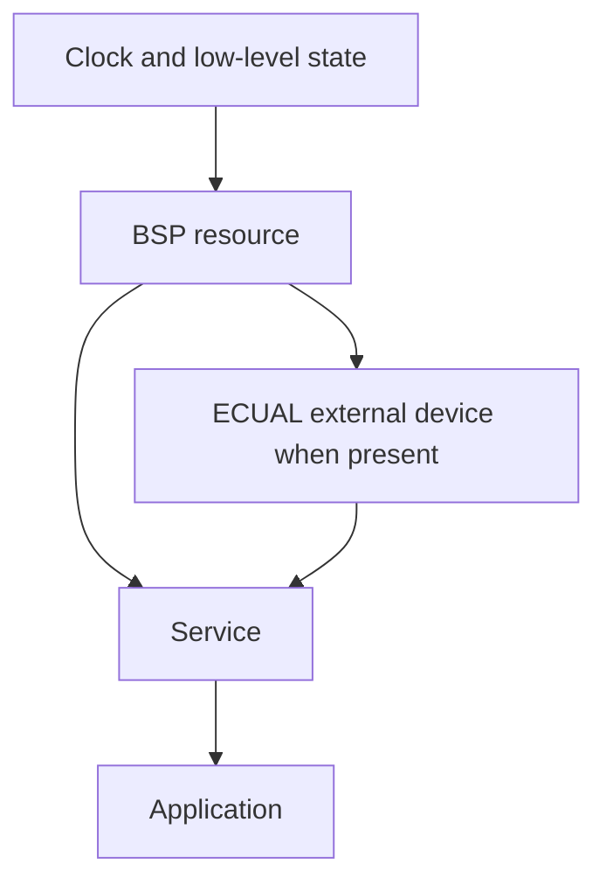

# Adding a New Module

> **Scope:** A source-to-documentation workflow for adding a peripheral, Service, off-chip device, data structure, or Application capability without breaking the repository's ownership and concurrency contracts.

[← Root](../../README.md) · [← Template README](../README.md) · [Architecture](architecture.md) · [Porting guide](porting_guide.md)

## Table of contents

- [Start from a behavioral requirement](#start-from-a-behavioral-requirement)
- [Choose the owner](#choose-the-owner)
- [Design the public contract](#design-the-public-contract)
- [Map hardware resources](#map-hardware-resources)
- [Add the minimum vendor support](#add-the-minimum-vendor-support)
- [Design polling, interrupts, or DMA](#design-polling-interrupts-or-dma)
- [Compose initialization](#compose-initialization)
- [Add observability and failure semantics](#add-observability-and-failure-semantics)
- [Validate and document](#validate-and-document)
- [References](#references)

## Start from a behavioral requirement

Write what the system needs before naming an SPL function:

```text
"Publish a debounced press event."
"Generate a 1 kHz PWM output with adjustable duty."
"Store/read a page in SPI NOR with bounded failure detection."
"Acquire analog samples at 1 kHz independent of loop jitter."
```

This prevents the architecture from being dictated accidentally by the first vendor API discovered.

## Choose the owner

| Question | Likely layer |
|---|---|
| Why should the product do this? | Application |
| What logical capability should Application see? | Service |
| Which physical pin/peripheral/IRQ/DMA channel is used? | BSP |
| What commands/state belong to an off-chip IC? | ECUAL |
| Is this generic queue/ring/CRC/math with no hardware identity? | Common |
| In what order are modules initialized? | System |

If a module needs two unrelated responsibilities, split the responsibilities before writing more APIs.

## Design the public contract

Prefer domain/generic arguments:

```c
bool uart_service_try_write_byte(uint8_t byte);
bool board_memory_bus_transfer(const uint8_t *tx, uint8_t *rx, size_t count);
void pwm_service_set_duty_permille(pwm_duty_permille_t duty);
```

Avoid pushing vendor structures upward:

```c
/* Do not make Application configure this. */
SPI_InitTypeDef config;
```

For each API define:

- blocking versus non-blocking/bounded behavior;
- ownership of input/output memory;
- whether data is copied or borrowed;
- legal range and units;
- failure return semantics;
- ISR/thread context restrictions.

## Map hardware resources

Document the physical allocation before implementation:

```text
logical resource -> peripheral -> channel/request -> pin -> IRQ -> clock bus
```

Review GPIO electrical mode as part of the peripheral, not as decoration:

- AF push-pull for USART TX/SPI clock/data outputs;
- AF open-drain for I2C;
- floating/input/pull-up according to input circuit;
- analog mode for ADC;
- safe inactive output level before enabling an external chip select or active-low load.

Keep those choices in BSP/configuration, not Application.

## Add the minimum vendor support

Add only required SPL `.c` modules to `config/modules.mk`, for example GPIO/RCC plus the actual peripheral and `misc.c` when SPL NVIC helpers are used.

Keep `GPIO_InitTypeDef`, `USART_InitTypeDef`, `TIM_TimeBaseInitTypeDef`, `SPI_InitTypeDef`, `I2C_InitTypeDef`, `ADC_InitTypeDef`, and `DMA_InitTypeDef` inside the lower implementation. Reset/deinit stale peripheral state when needed before applying a new configuration.

## Design polling, interrupts, or DMA

### Polling

Use either immediate readiness (`try_*`) or a bounded timeout. Do not add an infinite loop around a status flag.

### Interrupt

Write the handoff contract before the handler:

```text
source flag -> acknowledge -> bounded publication -> exception return
                                      |
                                      v
                           thread-mode consumption
```

Choose flag, counter, ring, or block publication based on whether coalescing/loss is acceptable.

### DMA

Define who owns each buffer during every phase. Circular DMA especially needs a rule for “hardware is writing this half while software processes that half.” If software can fall behind, explicitly choose queueing, overwrite-latest, backpressure, or fault behavior and count it.

Before enabling an IRQ/DMA request:

1. initialize storage/state;
2. clear stale peripheral/DMA pending flags;
3. configure priority;
4. enable the vector/request last.

The strong handler name must match the startup vector exactly.

## Compose initialization

Wire from dependencies upward in `system/system_init.c`:



If one initialization can fail, propagate the failure rather than letting a higher layer run against a half-initialized dependency.

## Add observability and failure semantics

A demo does not need a full logger, but it should expose enough state to answer “where did it fail?” Examples in this repository use:

- overflow/error counters;
- boolean stage results;
- JEDEC/debug IDs;
- ADC sequence/min/max/average/mV globals;
- steady/blinking LED failure/pass conventions;
- bounded timeout return values.

Do not print from a timing-sensitive ISR merely because diagnostics are needed.

## Validate and document

Minimum acceptance sequence:

```bash
python3 tools/scripts/check_layers.py
make clean
make
make size
```

Then validate on hardware from reset/clock upward. Stress the limit that defines the design: input bounce, sustained UART traffic, TX-full behavior, I2C NACK/stuck bus, SPI timeout/invalid ID, DMA overrun, threshold boundary, reset during an operation where relevant.

Update Markdown with:

- exact pins and electrical assumptions;
- clock/prescaler derivation;
- capacities and effective capacity;
- timeouts/interrupt priorities;
- ISR producer/consumer ownership;
- overflow/drop/coalescing policy;
- destructive operations;
- known limitations and what has **not** been validated.

## References

- [STMicroelectronics — STM32F103 documentation](https://www.st.com/en/microcontrollers-microprocessors/stm32f103/documentation.html)
- [STMicroelectronics — RM0008: STM32F101/102/103/105/107 reference manual](https://www.st.com/resource/en/reference_manual/cd00171190-stm32f101xx-stm32f102xx-stm32f103xx-advanced-arm-based-32-bit-mcus-stmicroelectronics.pdf)
- [STMicroelectronics — PM0056: STM32F10xxx Cortex-M3 programming manual](https://www.st.com/resource/en/programming_manual/pm0056-stm32f10xxx20xxx21xxxl1xxxx-cortexm3-programming-manual-stmicroelectronics.pdf)
- [Arm — CMSIS Core documentation](https://arm-software.github.io/CMSIS_5/Core/html/index.html)
- [GNU Binutils — linker scripts](https://sourceware.org/binutils/docs/ld/Scripts.html)
- [OpenOCD documentation](https://openocd.org/pages/documentation.html)
- [GDB — remote debugging](https://sourceware.org/gdb/current/onlinedocs/gdb.html/Remote-Debugging.html)
