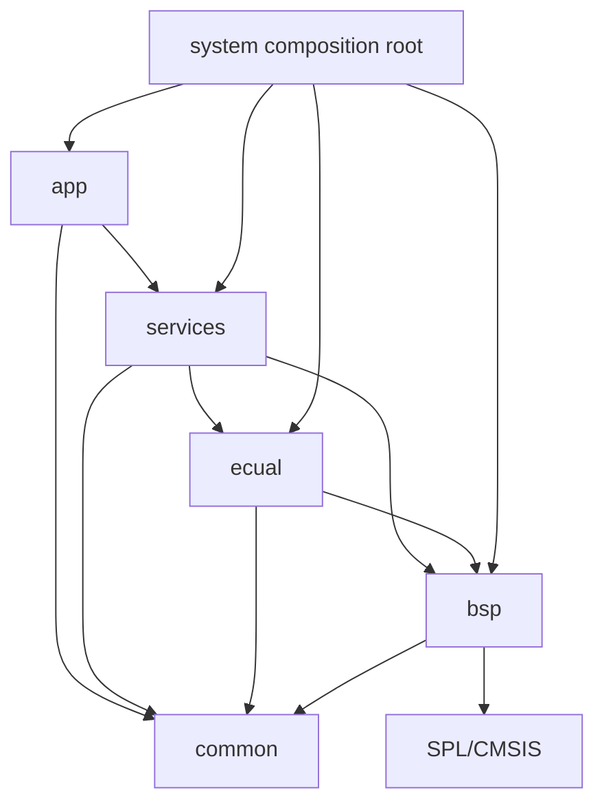

# Architecture — Project Template

> **Scope:** Architectural rules that all examples inherit: dependency direction, startup/linker ownership, composition, interrupt handoff, static memory, configuration, and validation boundaries.

[← Root](../../README.md) · [← Template README](../README.md) · [Adding a module](adding_a_module.md) · [Porting guide](porting_guide.md)

## Table of contents

- [Architectural goals](#architectural-goals)
- [Layer responsibilities](#layer-responsibilities)
- [Allowed dependency direction](#allowed-dependency-direction)
- [Composition root](#composition-root)
- [Startup and memory ownership](#startup-and-memory-ownership)
- [Interrupt and thread-mode handoff](#interrupt-and-thread-mode-handoff)
- [Shared-state rules](#shared-state-rules)
- [Configuration and vendor isolation](#configuration-and-vendor-isolation)
- [Validation and architectural checks](#validation-and-architectural-checks)
- [References](#references)

## Architectural goals

The template is optimized for **explicit reasoning**, not minimum file count. Its architecture tries to make four contracts visible:

1. **dependency contract** — higher policy depends on stable capabilities, not board/vendor details;
2. **lifecycle contract** — reset, C memory initialization, module initialization, loop, and panic have explicit owners;
3. **concurrency contract** — every ISR/shared buffer has a named producer/consumer and publication rule;
4. **resource contract** — pins, peripheral instances, clocks, interrupts, DMA channels, and external-device buses have one lower-layer owner.

## Layer responsibilities

| Layer | Owns | Must not own |
|---|---|---|
| Application | product/demo policy, high-level state | SPL structs, board pins, IRQ flag clearing |
| Services | logical capabilities, qualification/aggregation | hard-coded physical board mapping |
| ECUAL | external-device commands/protocol/state | STM32 pin identities, product policy |
| BSP | pins, buses, STM32 peripheral resources, lowest ISR | product behavior |
| Common | portable data structures/types/algorithms | device headers |
| Config | compile-time policy and selected modules | runtime behavior |
| System | initialization order, `main`, idle/panic wiring | product state machine |
| Platform/Runtime | architecture/runtime-specific extensions when needed | arbitrary catch-all code |
| Vendor | SPL/CMSIS implementation | first-party policy |

## Allowed dependency direction



`tools/scripts/check_layers.py` parses local include relationships and rejects forbidden layer edges. That makes architecture part of CI/build behavior rather than prose only.

## Composition root

`system/system_init.c` is allowed to know all public module APIs because its job is to compose them. Initialization should move from physical dependencies upward:

```text
clock/pin/peripheral storage
          ↓
BSP resource initialized
          ↓
external device / Service initialized
          ↓
Application initialized last
```

An interrupt must not be enabled before its state/buffer is ready. A Service must not call an ECUAL/BSP dependency before that dependency is initialized.

## Startup and memory ownership

`startup_stm32f10x_md.S` owns the vector table and reset code. The linker script supplies section symbols used by Reset_Handler.

```mermaid
sequenceDiagram
    participant CPU as Cortex-M3
    participant START as Reset_Handler
    participant LINK as Linker-defined symbols
    participant CMSIS as SystemInit
    participant SYS as Project main/system

    CPU->>START: reset vector
    START->>LINK: _sidata, _sdata, _edata
    START->>START: copy initialized data to SRAM
    START->>LINK: _sbss, _ebss
    START->>START: zero BSS
    START->>CMSIS: configure clock tree
    START->>SYS: main()
```

The linker models 64 KiB Flash and 20 KiB SRAM, keeps the vector table, assigns `.data` load/run addresses, allocates `.bss`, reserves stack headroom, and defines zero linker heap. Static allocation still needs review because automatic stack usage is not fully proven by a linker memory total.

## Interrupt and thread-mode handoff

Choose the publication primitive to match the event semantics:

```text
single/coalescing event       -> boolean flag
counted diagnostics/events    -> counter
continuous byte stream        -> SPSC ring
periodic sample blocks        -> ping-pong/staging block or queue
complex long operation        -> thread-mode state machine
```

The lowest layer that owns the interrupt source implements the exact strong handler symbol from the vector table. ISR work should be bounded: snapshot/clear flags, move a bounded datum, update diagnostics, publish work, return.

## Shared-state rules

`volatile` means accesses must remain observable to the abstract machine; it does **not** make a compound sequence atomic and does not replace an ownership model.

Repository patterns include:

- PRIMASK-protected take-and-clear for EXTI event publication;
- fixed SPSC producer/consumer roles for UART rings;
- compiler barriers at ring publication boundaries;
- PRIMASK-protected copy/take of a DMA staging block;
- overwrite-and-count policy when the ADC latest-block slot is already pending.

Before adding shared state, write down producer, consumer, lifetime, capacity, overflow/drop policy, and atomicity requirement.

## Configuration and vendor isolation

`config/` holds project constants such as baud, timebase, debounce, timer rates, timeouts, thresholds, and `config/modules.mk` vendor source selection. SPL `*_InitTypeDef` structures remain below BSP/low-level boundaries.

That isolation lets a Service API survive a change from polling to IRQ/DMA or from one board mapping to another.

## Validation and architectural checks

Validation should proceed from low-level contracts upward:

1. layer checker passes;
2. startup/linker reach `main` and initialize memory correctly;
3. core/bus clocks match assumptions;
4. GPIO electrical states are safe;
5. peripheral basic transaction works;
6. interrupt/DMA publication works under load;
7. Service semantics match policy;
8. Application behavior and failure paths are observable;
9. map/size and stack headroom are reviewed.

The layer checker currently passes for the template and all eight completed examples in this repository snapshot.

## References

- [STMicroelectronics — STM32F103 documentation](https://www.st.com/en/microcontrollers-microprocessors/stm32f103/documentation.html)
- [STMicroelectronics — RM0008: STM32F101/102/103/105/107 reference manual](https://www.st.com/resource/en/reference_manual/cd00171190-stm32f101xx-stm32f102xx-stm32f103xx-advanced-arm-based-32-bit-mcus-stmicroelectronics.pdf)
- [STMicroelectronics — PM0056: STM32F10xxx Cortex-M3 programming manual](https://www.st.com/resource/en/programming_manual/pm0056-stm32f10xxx20xxx21xxxl1xxxx-cortexm3-programming-manual-stmicroelectronics.pdf)
- [Arm — CMSIS Core documentation](https://arm-software.github.io/CMSIS_5/Core/html/index.html)
- [GNU Binutils — linker scripts](https://sourceware.org/binutils/docs/ld/Scripts.html)
- [OpenOCD documentation](https://openocd.org/pages/documentation.html)
- [GDB — remote debugging](https://sourceware.org/gdb/current/onlinedocs/gdb.html/Remote-Debugging.html)
